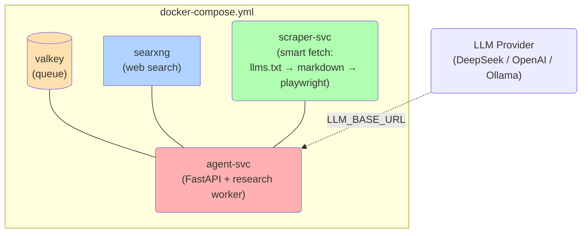

# GroktoCrawl

**Self-hosted, API-compatible Firecrawl alternative with Agent endpoint. MIT licensed. One `docker compose up` and you're running.**

GroktoCrawl implements the Firecrawl v2 API surface — scrape, search, map, crawl, and the **Agent** endpoint (autonomous web research) — without the closed-source dependencies. Runs entirely in Docker on your own hardware. Bring your own LLM or use the built-in fixtures.

## Quick Start

```bash
cp .env.sample .env
docker compose up --build -d
```

Six containers start. The default stack uses fixture services so everything works without API keys.

```bash
# CLI
./groktocrawl scrape https://example.com
./groktocrawl search "raspberry pi 5" --limit 3
./groktocrawl agent "What were the key Google I/O 2025 announcements?"

# Or raw curl
curl http://localhost:8080/health
curl -X POST http://localhost:8080/v2/scrape -H "Content-Type: application/json" \
  -d '{"url": "https://example.com"}'
```

## Production Setup

Edit `.env` to point at a real LLM:

```env
# DeepSeek
LLM_API_KEY=sk-...
LLM_BASE_URL=https://api.deepseek.com/v1
LLM_MODEL=deepseek-v4-flash

# OpenAI
LLM_API_KEY=sk-...
LLM_BASE_URL=https://api.openai.com/v1
LLM_MODEL=gpt-4o-mini

# Ollama (local)
LLM_BASE_URL=http://host.docker.internal:11434/v1
LLM_MODEL=llama3.2
```

The stack includes **SearXNG** for real web search (enabled by default). Fixture services (`search-svc`, `llm-svc`, `test-site`) run only with `--profile fixture`.

## Architecture



The scraper uses a **three-tier strategy**: check `/llms.txt` first, try `Accept: text/markdown` second, render with Playwright third.

## CLI

`groktocrawl` is a CLI tool in the repo root. It needs `requests` (`pip install requests`).

```bash
./groktocrawl scrape <url>                  # Scrape a page to markdown
./groktocrawl search <query> --limit 5      # Search the web
./groktocrawl map <url> --limit 100         # Discover URLs on a site
./groktocrawl crawl <url> --max-depth 2     # Crawl a website
./groktocrawl agent "<prompt>"              # Autonomous research agent
./groktocrawl --json --server <url> <cmd>   # JSON output, custom server
```

## API Endpoints

| Method | Endpoint | Description |
|--------|----------|-------------|
| POST | `/v2/scrape` | Scrape a single URL to clean markdown |
| POST | `/v2/agent` | Start an autonomous research agent |
| GET | `/v2/agent/:jobId` | Get agent job status and results |
| DELETE | `/v2/agent/:jobId` | Cancel an agent job |
| POST | `/v2/crawl` | Crawl a website |
| GET | `/v2/crawl/:jobId` | Get crawl status |
| DELETE | `/v2/crawl/:jobId` | Cancel a crawl |
| POST | `/v2/batch/scrape` | Scrape multiple URLs |
| POST | `/v2/search` | Search the web with content |
| POST | `/v2/map` | Discover URLs on a site |

All Firecrawl v2 API-compatible.

## Comparison to Firecrawl

| Feature | Firecrawl Cloud | Firecrawl Self-Hosted | GroktoCrawl |
|---------|----------------|----------------------|-------------|
| Scrape / Crawl / Map | ✅ | ✅ | ✅ |
| Agent endpoint | ✅ | ❌ (closed-source) | ✅ |
| Browser sessions | ✅ | ❌ (closed-source) | Post-MVP |
| License | Proprietary | AGPL-3.0 | **MIT** |
| Self-contained Docker | ✅ | ⚠️ requires Supabase, Stripe | **✅ one file** |
| LLM integration | Built-in | Requires API key | **BYO or fixture** |

## Project Status

MVP. All core endpoints implemented and integration-tested. Contributions welcome — see [CONTRIBUTING.md](CONTRIBUTING.md).
