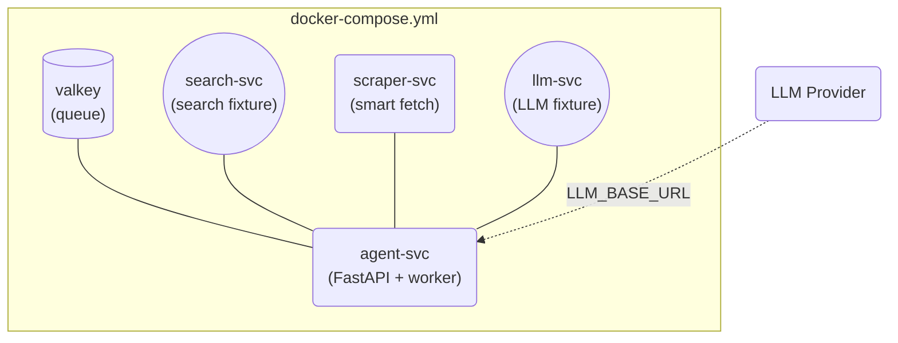

# GroktoCrawl

**Self-hosted, API-compatible Firecrawl alternative. MIT licensed. One `docker compose up` and you're running.**

GroktoCrawl is a drop-in replacement for the [Firecrawl](https://firecrawl.dev) v2 API that runs entirely in Docker on your own hardware. It implements the core scraping endpoints and the **Agent** endpoint — the autonomous web research feature that most open-core scraping tools gate behind a paid plan.

## Quick Start

```bash
cp .env.sample .env
docker compose up --build -d
```

That's it. Six containers start. The stack is fully self-contained with fixture services so you can verify everything works without any external API keys.

```bash
# Check health
curl http://localhost:8080/health

# Scrape a page
curl -X POST http://localhost:8080/v2/scrape \
  -H "Content-Type: application/json" \
  -d '{"url": "https://example.com"}'

# Start a research agent
curl -X POST http://localhost:8080/v2/agent \
  -H "Content-Type: application/json" \
  -d '{"prompt": "What is the capital of France?"}'

# Check agent status
curl http://localhost:8080/v2/agent/<job_id>
```

## Using a Real LLM

The default stack uses a deterministic LLM fixture for testing. To use a real LLM, edit `.env`:

```env
LLM_API_KEY=sk-your-key
LLM_BASE_URL=https://api.openai.com/v1
LLM_MODEL=gpt-4o-mini
```

Works with any OpenAI-compatible API: OpenAI, Anthropic, OpenRouter, Ollama, llama.cpp, vLLM, etc.

## API Endpoints

| Method | Endpoint | Description |
|--------|----------|-------------|
| POST | `/v2/scrape` | Scrape a single URL to clean markdown |
| POST | `/v2/agent` | Start an autonomous research agent |
| GET | `/v2/agent/:jobId` | Get agent job status and results |
| DELETE | `/v2/agent/:jobId` | Cancel an agent job |
| POST | `/v2/crawl` | Crawl a website |
| GET | `/v2/crawl/:jobId` | Get crawl status |
| DELETE | `/v2/crawl/:jobId` | Cancel a crawl |
| POST | `/v2/batch/scrape` | Scrape multiple URLs |
| POST | `/v2/search` | Search the web with content |
| POST | `/v2/map` | Discover URLs on a site |

All endpoints are Firecrawl v2 API-compatible in request/response shape.

## Architecture



Six containers, one `docker-compose.yml`. The scraper uses a three-tier strategy: check `/llms.txt` first, try `Accept: text/markdown` second, render with Playwright third.

## Comparison to Firecrawl

| Feature | Firecrawl Cloud | Firecrawl Self-Hosted | GroktoCrawl |
|---------|----------------|----------------------|-------------|
| Scrape / Crawl / Map | ✅ | ✅ | ✅ |
| Agent endpoint | ✅ | ❌ (closed-source) | ✅ |
| Browser sessions | ✅ | ❌ (closed-source) | Post-MVP |
| License | Proprietary | AGPL-3.0 | **MIT** |
| Self-contained Docker | ✅ | ⚠️ requires Supabase, Stripe, etc. | **✅ one file** |
| LLM integration | Built-in | Requires API key | **BYO or fixture** |

## Project Status

MVP. All core endpoints are implemented and tested. Contributions welcome — see [CONTRIBUTING.md](CONTRIBUTING.md).
