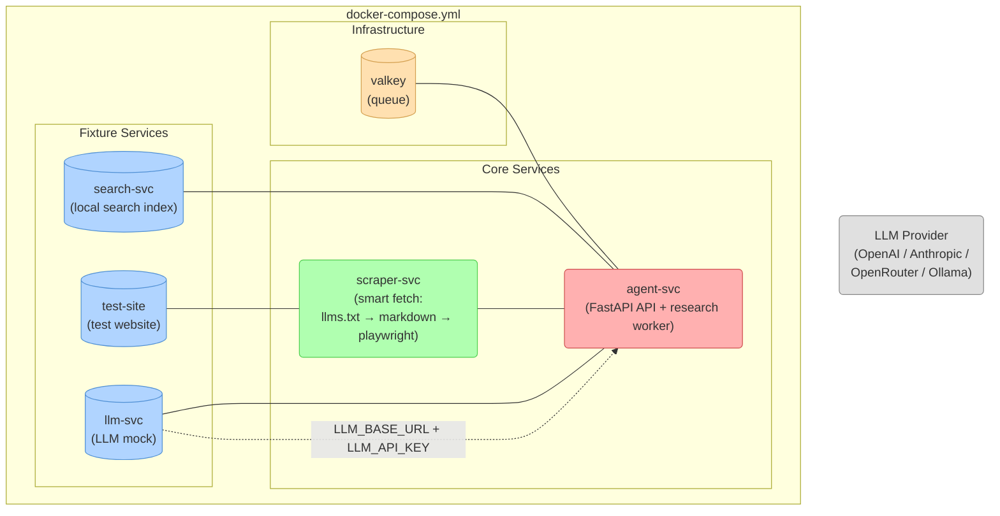

# GroktoCrawl

**A self-hosted, API-compatible Firecrawl alternative. MIT licensed. Architecture so simple it fits in your head.**

---

## The Vision

Firecrawl is a great product. Their open-core model makes strategic sense for them: the core scraping API is AGPL and runs self-hosted, while the premium features — Agent, Browser Sessions, Support, Fire Engine — are closed-source services that only run on their infrastructure.

But there's a gap in the market: **a genuinely simple, self-contained, MIT-licensed service** that implements the full Firecrawl API surface, including the Agent endpoint, without requiring a dozen microservices, Supabase, Stripe, or a Fortune 500 infrastructure budget.

GroktoCrawl is that gap.

### Why "GroktoCrawl"?

To grok is to understand deeply. The point isn't to replicate Firecrawl's architecture — it's to understand what the Firecrawl API *does* for its users and deliver that with an order of magnitude less complexity.

### Design Principles

1. **Self-contained** — `docker compose up` and you're running. No external dependencies beyond an LLM API key.
2. **Truly open** — MIT license. Fork it, embed it, ship it. No open-core gotchas.
3. **API-compatible first, own identity second** — Match the Firecrawl API surface so existing SDKs and tooling work immediately. Evolve from there.
4. **The agent is the product** — The Agent endpoint is the killer feature. It's not an upsell; it's the main event.
5. **Smart scraping, not brute force** — Check `/llms.txt`, try `Accept: text/markdown`, *then* launch Playwright. Respect the web's agent-friendly signals.
6. **Minimal moving parts** — One API server, one worker, one queue, one scraper service, one search engine. Five containers. That's it.
7. **BYO LLM** — Bring your own key. OpenAI, Anthropic, OpenRouter, Ollama, llama.cpp, vLLM — anything with an OpenAI-compatible API.

### What We're Not

- Not a SaaS business (no billing, no multi-tenant auth, no credit tracking)
- Not a scraping farm (no proxy rotation, no headless browser pools)
- Not a replacement for Firecrawl Cloud (if you want managed infrastructure, use their excellent service)
- Not an anti-bot arms race (we handle the common cases and let communities like ours contribute more)

---

## MVP Product Requirements Document

### 1. Target API Compatibility

Implement the following Firecrawl v2 endpoints with matching request/response schemas:

**Core scraping:**
- `POST /v2/scrape` — Scrape a single URL
- `POST /v2/crawl` — Crawl a website
- `GET /v2/crawl/:jobId` — Crawl status
- `DELETE /v2/crawl/:jobId` — Cancel crawl
- `POST /v2/map` — Discover URLs on a site
- `POST /v2/search` — Web search with content
- `POST /v2/batch/scrape` — Scrape multiple URLs

**Agent (the headline feature):**
- `POST /v2/agent` — Start an autonomous research agent
- `GET /v2/agent/:jobId` — Agent status
- `DELETE /v2/agent/:jobId` — Cancel agent job

**Not in MVP:**
- Browser sessions (`/v2/browser/*`) — requires persistent browser orchestration
- Support agent (`/v2/support/*`) — not relevant for self-hosted
- Extract (`/v2/extract`) — subsumed by Agent
- Monitor endpoints — cron-based, can be external
- V1 API — v2 is the modern surface

### 2. Architecture



#### Containers

| Container | Base Image | Purpose |
|-----------|-----------|---------|
| `agent-svc` | python:3.13-slim | FastAPI server + async research worker. Core application logic. |
| `scraper-svc` | python:3.13-slim + playwright | URL → markdown. Three-tier fetch strategy (llms.txt → Accept: markdown → Playwright). |
| `search-svc` | python:3.13-slim | Local search fixture. Replaceable with SearXNG. |
| `llm-svc` | python:3.13-slim | Deterministic OpenAI-compatible LLM fixture. Replaceable with any LLM endpoint. |
| `valkey` | valkey/valkey:8-alpine | Job queue backend (future: persistent queue). |
| `test-site` | python:3.13-slim | Fixture website for integration tests. |

#### File Structure

```
groktocrawl/
├── docker-compose.yml
├── .env.example
├── LICENSE                    # MIT
├── VISION.md                  # This file
├── agent-svc/
│   ├── Dockerfile
│   ├── pyproject.toml
│   └── agent/
│       ├── __init__.py
│       ├── app.py            # FastAPI application entrypoint
│       ├── api.py            # Route handlers
│       ├── models.py         # Pydantic request/response schemas
│       ├── worker.py         # Job processing functions
│       ├── research.py       # The agent research loop
│       ├── scraper_client.py # HTTP client to scraper-svc
│       ├── searxng_client.py # Search API client
│       ├── llm.py            # OpenAI-compatible LLM client
│       └── store.py          # Job CRUD (valkey-backed)
├── scraper-svc/
│   ├── Dockerfile
│   ├── pyproject.toml
│   └── scraper/
│       ├── __init__.py
│       ├── app.py            # FastAPI, single /scrape endpoint
│       ├── fetch.py          # Three-tier fetch strategy
│       └── extract.py        # HTML → markdown conversion
├── search-svc/               # Local search fixture
├── llm-svc/                  # OpenAI-compatible LLM fixture
├── test-site/                # Fixture website for integration tests
├── tests/
│   └── test_stack.py         # Integration tests against Docker stack
├── docker-compose.yml
├── .env.sample
├── LICENSE
├── README.md
└── VISION.md
```

### 3. The Smart Scraper (Three-Tier Strategy)

The scraper service implements an escalating strategy to minimize resource usage:

```python
async def smart_scrape(url: str) -> str:
    """Cheapest path first. Escalate only when necessary."""

    # Tier 1: /llms.txt — one request, whole site in markdown
    # Catches sites using the emerging agent-content standard
    text = await try_llms_txt(url)
    if text:
        return text

    # Tier 2: Accept: text/markdown — per-page markdown
    # Catches sites with content negotiation (Hugo, WordPress plugins, etc.)
    text = await try_content_negotiation(url)
    if text:
        return text

    # Tier 3: Playwright + readability
    # Heavyweight JS rendering, then extract the main content
    html = await playwright_render(url)
    return html_to_markdown(html)

    # (crawl4ai incorporated as an option within the playwright step
    #  for anti-bot bypass when needed)
```

This is both more performant *and* more polite than brute-force scraping. Sites that signal agent-friendliness get rewarded with efficient, low-impact traffic.

### 4. The Agent Research Loop

The endpoint that justifies the entire project:

```
POST /v2/agent
{
  "prompt": "Compare the pricing of Notion, Coda, and Monday.com",
  "schema": { ... },               // optional structured output
  "urls": ["..."],                 // optional seed URLs
  "model": "spark-1-pro"           // model hint (maps to our LLM config)
}
→ { "success": true, "id": "job_xxx" }

GET /v2/agent/job_xxx
→ { "success": true, "status": "completed", "data": { ... } }
```

The research loop:

```
worker receives job
├── parse prompt → extract intent
├── if no urls:
│   ├── search web → get candidate URLs
│   └── filter + rank results
├── for each URL:
│   ├── smart_scrape(url) → clean markdown
│   └── accumulate into context
├── if schema provided:
│   └── LLM.generate(prompt + context, structured_output=schema)
├── else:
│   └── LLM.generate(prompt + context)
├── store result
├── fire webhook if configured
└── mark job complete
```

The loop can be extended with multi-turn research (search again based on what was found, scrape follow-up pages, refine answer) — but the MVP makes one thorough pass. The sophistication comes from the prompt and the LLM, not from complex agent frameworks.

### 5. Configuration & Environment

```env
# Required
LLM_API_KEY=sk-...                # Your LLM provider key
LLM_BASE_URL=https://api.openai.com/v1  # OpenAI-compatible endpoint
LLM_MODEL=gpt-4o-mini            # Model name

# Optional (sensible defaults)
VALKEY_URL=redis://valkey:6379/0
SEARXNG_URL=http://searxng:8080
SCRAPER_URL=http://scraper-svc:8001
API_KEY=                          # If set, requires this on Authorization header
HOST=0.0.0.0
PORT=8080
```

### 6. MVP Exit Criteria

A user should be able to:

1. `docker compose up` on a machine with Docker installed
2. Set `LLM_API_KEY` in `.env`
3. `curl POST /v2/agent -d '{"prompt": "What is the capital of France?"}'`
4. Poll for results
5. Get back structured data matching the Firecrawl agent response format
6. Also use the basic scrape, search, crawl, and map endpoints

That's it. Everything else (multi-turn research, schema validation, webhook delivery, performance optimization) is post-MVP polish.

### 7. Non-Goals (MVP)

- Authentication/authorization (single API key or no auth for local use)
- Billing, credits, rate limiting
- Multi-tenant isolation
- Admin UI
- SDKs (the HTTP API *is* the SDK)
- WebSocket streaming
- Browser session orchestration
- Fire Engine / anti-bot proxy rotation
- Extensive test suite (a smoke test that the containers start and endpoints respond)

### 8. Licensing

**MIT License.** The entire project, including all source code, Docker configurations, and documentation, is released under the MIT license. No open-core split, no AGPL restrictions for commercial use, no "contact us for enterprise features." Fork it, embed it, build on it.

---

## Why This Will Work

The Agent endpoint doesn't need to be hard. Firecrawl's implementation is complex because it integrates with their existing multi-engine scraping infrastructure, their billing system, their multi-tenant auth, and their CDP-based browser orchestration.

None of that is inherent to the *problem* of "given a prompt, find information on the web and return it." That problem is:

1. Search for relevant pages
2. Read them
3. Think about what you found
4. Answer the prompt

We have open-source tools for steps 1 and 2 (SearXNG, Playwright). We have a commodity API for step 3 (any LLM). Step 4 is just formatting.

The complexity of the big scraper companies comes from scale, not from the core capability. Scale is a great problem to have, but it's not our problem. Our job is to make the capability accessible with `docker compose up`.
