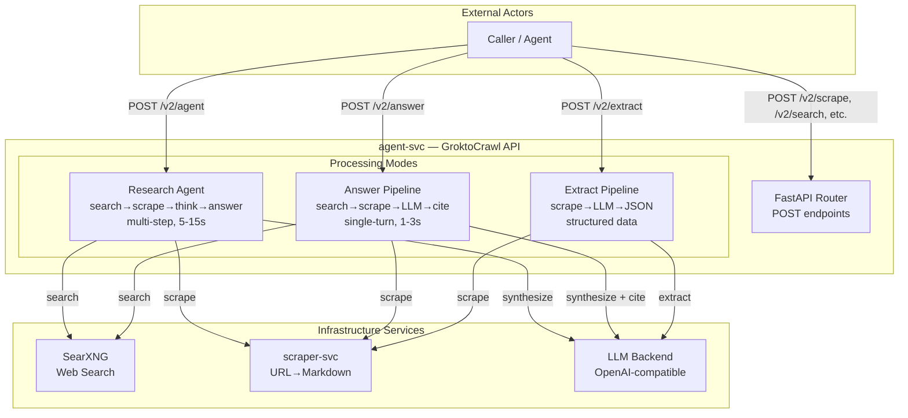
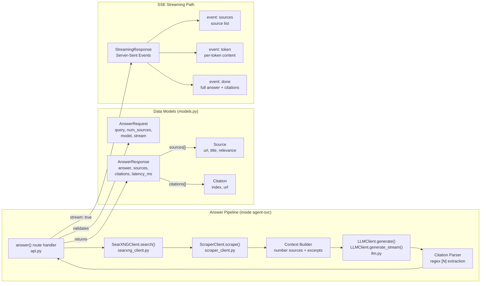

# Grounded Q&A Endpoint — Synchronous Single-Turn with SSE Streaming

* Status: accepted
* Deciders: magnus, jasper
* Date: 2026-06-06

Technical Story: GroktoCrawl needs a lightweight grounded Q&A endpoint that fills the gap between raw search results (`/v2/search`) and the deep autonomous research agent (`/v2/agent`). This is the most common primitive for AI agent tool use — ask a question, get a cited answer in one round-trip.

## Context and Problem Statement

GroktoCrawl has two modes for answering questions:

| Mode | Endpoint | Latency | Use Case |
|---|---|---|---|
| **Raw search** | `POST /v2/search` | <1s | Caller wants URLs, will synthesize themselves |
| **Deep research** | `POST /v2/agent` | 5-15s+ | Caller wants thorough multi-source investigation |

A caller who wants to know "What is the current Fed interest rate?" should not need to:
1. Call `/v2/search`, get 10 URLs
2. Scrape each URL
3. Feed context to an LLM themselves
4. Parse citations from the LLM output

Nor should they need to wait 5-15s for the full agent research loop when the question needs one search + one scrape + one LLM call.

This missing middle is what Exa's `/answer` endpoint provides — it is the single most common primitive for AI agent tool use.

## Decision Drivers

* Must be a **single-turn** request-response — one call, one answer. No job ID, no polling.
* Must return in **1-3s** (vs 5-15s for the agent)
* Must be **citation-grounded** — every factual claim must trace to a source URL
* Must support both **synchronous** (simple consumption) and **streaming** (real-time display) modes
* Must **reuse existing infrastructure** — SearXNG for search, scraper-svc for content extraction, the configured LLM for synthesis. No new dependencies.
* Must not duplicate the agent's research loop — this is a simpler, faster path, not a competing agent

## Considered Options

### A. Synchronous single-turn endpoint with SSE streaming *(chosen)*

A single `POST /v2/answer` endpoint that returns synchronously. Internally runs search → scrape top N results → LLM synthesis → citation parsing. Optional `stream: true` flag switches to Server-Sent Events for real-time token delivery.

**Pipeline:** `request → SearXNG search → scrape excerpts → build numbered context → LLM call (grounded) → regex citation extraction → response`

**Positive:**
- Fits 1-3s latency target (single LLM call, no iterative search/scrape loop)
- Sync mode: simple curl/agent consumption — no webhook, no polling
- SSE streaming: real-time display in chat UIs
- Fully reuses existing infrastructure (SearXNG client, scraper client, LLM client)
- No new dependencies

**Negative:**
- LLM response time dominates latency for complex queries
- Citation parsing is regex-based rather than structured LLM output — fragile if LLM uses non-standard citation format
- No retry mechanism — entire request must be retried on failure

### B. Async job-based endpoint with webhook (existing pattern)

Follow the pattern established by ADR-012: return a job ID, process in background, fire webhook on completion, let caller poll `GET /v2/answer/:id`.

**Positive:**
- Consistent with all other block endpoints (agent, crawl, extract, generate-llmstxt)
- Webhook delivery enables event-driven workflows
- No HTTP timeout concerns — caller can poll at their leisure

**Negative:**
- Adds latency overhead (job creation → async dispatch → polling)
- Requires a new `GET /v2/answer/:id` endpoint and job store entries
- Poor fit for the use case — Q&A should feel like a query, not a job submission
- Webhook infrastructure is overengineered for a 1-3s operation

### C. Extend the agent to auto-detect simple vs deep questions

A single agent endpoint that classifies questions and chooses a fast path (search → scrape → answer) or deep path (multi-step research) accordingly.

**Positive:**
- Single entry point for all question-answering

**Negative:**
- Internal complexity — the agent would need to classify questions, switch between two execution paths, and report which path was taken
- Hard to debug — caller doesn't know whether they got the fast path or deep path
- Defeats the purpose of having a predictable, fast endpoint

### D. SSE-only endpoint (no sync mode)

A streaming-only endpoint with no synchronous fallback.

**Positive:**
- Simpler implementation — one code path

**Negative:**
- Forces every consumer to handle SSE parsing, even for simple use cases
- Incompatible with curl/httpx in simple request mode
- Wastes tokens on the `data: [DONE]` framing for synchronous consumers

## Decision Outcome

Chosen option: **A. Synchronous single-turn endpoint with optional SSE streaming.**

The endpoint is explicitly **not** an async job-based endpoint (contrary to ADR-012's pattern for agent/crawl/extract). The rationale: Q&A is a query, not a job. Sub-second search, scrape in <1s, LLM in <3s — the total is fast enough that async infrastructure (job IDs, polling, webhooks) adds unnecessary complexity.

SSE streaming is an optional overlay on the synchronous path, not a separate processing mode. When `stream: false` (default), the caller receives a complete structured JSON response. When `stream: true`, the same pipeline delivers tokens in real-time with a final `done` event containing the full answer and citation metadata.

### Key Implementation Details

- **Search results:** 1-20 sources (default 5), controlled by `num_sources` parameter
- **Scraping:** Only excerpts are used (first 8000 chars per source) — not full-page content
- **LLM prompt:** Dedicated `ANSWER_SYSTEM_PROMPT` — concise, citation-focused, distinct from the full research agent prompt
- **Citation format:** Inline `[N]` markers in the answer text, resolved to URLs in the structured response via regex
- **Latency tracking:** `latency_ms` field returned in both sync and streaming modes
- **Auth header fix:** The LLM client's unconditional `Authorization: Bearer` header was changed to conditional (only sent when `api_key` is non-empty). This was necessary because the LLM fixture (and some LLM backends) reject empty Bearer tokens. Discovered during integration testing.

### LLMClient.generate_stream()

A new async generator method on `LLMClient` that supports SSE-style token-by-token streaming from any OpenAI-compatible backend. Yields structured events (`token`, `done`, `error`) rather than raw SSE bytes, making it compatible with any streaming consumer. Uses `httpx.AsyncClient.stream()` for efficient backpressure-aware consumption.

### Positive Consequences

* Single-turn Q&A in 1-3s with grounded citations — fills the primary gap in the API surface
* Sync mode enables simple consumption (curl, agent tool calls, CLI)
* SSE streaming enables real-time display (chat UIs, dashboards)
* No new dependencies — reuses `SearXNGClient`, `ScraperClient`, `LLMClient`
* No webhook infrastructure needed for a synchronous endpoint

### Negative Consequences

* Breaks from ADR-012's webhook pattern — every **async** endpoint gets webhooks, but this endpoint is deliberately synchronous. Consumers expecting the async pattern will need to adjust.
* Citation quality depends on the LLM following the `[N]` format instruction — if the LLM uses a different citation style (footnotes, parenthetical URLs), the regex parser returns empty citations. Mitigation: the sources list is always returned regardless of citation parsing success.
* Search + scrape + LLM latency is additive — if SearXNG is slow (<500ms) and the LLM is slow (>3s), the total exceeds the 1-3s target. The endpoint degrades gracefully but cannot guarantee latency.
* No webhook/retry — callers must handle failures themselves.

## Links

* Issue #61 — Feature request: POST /v2/answer
* PR #117 — Implementation
* ADR-0012 — Webhook delivery for async endpoints (documenting the pattern this endpoint deliberately diverges from)
* Exa Answer API — https://exa.ai/docs/reference/answer.md (inspiration for the design)

---

## Architecture Diagrams

### C4 Level 2 — Container View (Updated)

The agent-svc container now has two distinct processing modes for question-answering alongside the existing endpoints:

### C4 Level 3 — Component View: Answer Pipeline

