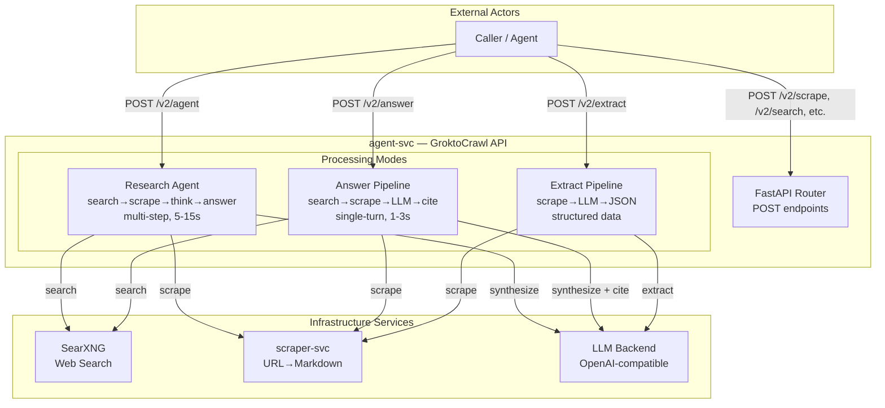
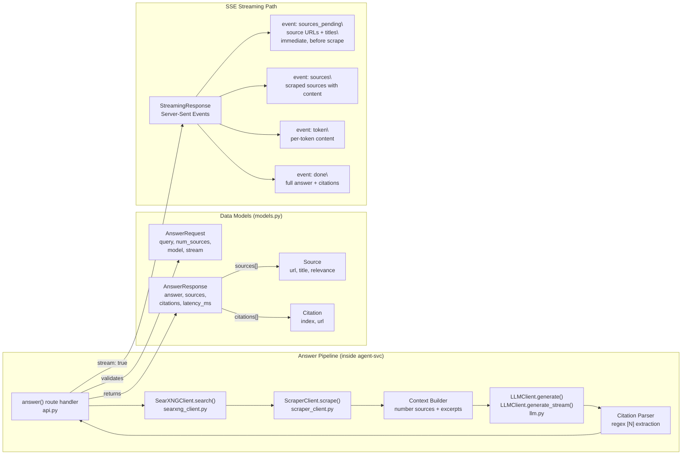

# Grounded Q&A Endpoint — Synchronous Single-Turn with SSE Streaming

* Status: accepted
* Deciders: magnus, jasper
* Date: 2026-06-06

Technical Story: GroktoCrawl needs a lightweight grounded Q&A endpoint that fills the gap between raw search results (`/v2/search`) and the deep autonomous research agent (`/v2/agent`). This is the most common primitive for AI agent tool use — ask a question, get a cited answer in one round-trip.

## Context and Problem Statement

GroktoCrawl has two modes for answering questions:

| Mode | Endpoint | Latency | Use Case |
|---|---|---|---|
| **Raw search** | `POST /v2/search` | <1s | Caller wants URLs, will synthesize themselves |
| **Deep research** | `POST /v2/agent` | 5-15s+ | Caller wants thorough multi-source investigation |

A caller who wants to know "What is the current Fed interest rate?" should not need to:
1. Call `/v2/search`, get 10 URLs
2. Scrape each URL
3. Feed context to an LLM themselves
4. Parse citations from the LLM output

Nor should they need to wait 5-15s for the full agent research loop when the question needs one search + one scrape + one LLM call.

This missing middle is what Exa's `/answer` endpoint provides — it is the single most common primitive for AI agent tool use.

## Decision Drivers

* Must be a **single-turn** request-response — one call, one answer. No job ID, no polling.
* Must return in **1-3s** (vs 5-15s for the agent)
* Must be **citation-grounded** — every factual claim must trace to a source URL
* Must support both **synchronous** (simple consumption) and **streaming** (real-time display) modes
* Must **reuse existing infrastructure** — SearXNG for search, scraper-svc for content extraction, the configured LLM for synthesis. No new dependencies.
* Must not duplicate the agent's research loop — this is a simpler, faster path, not a competing agent

## Considered Options

### A. Synchronous single-turn endpoint with SSE streaming *(chosen)*

A single `POST /v2/answer` endpoint that returns synchronously. Internally runs search → scrape top N results → LLM synthesis → citation parsing. Optional `stream: true` flag switches to Server-Sent Events for real-time token delivery.

**Pipeline:** `request → SearXNG search → scrape excerpts → build numbered context → LLM call (grounded) → regex citation extraction → response`

**Positive:**
- Fits 1-3s latency target (single LLM call, no iterative search/scrape loop)
- Sync mode: simple curl/agent consumption — no webhook, no polling
- SSE streaming: real-time display in chat UIs
- Fully reuses existing infrastructure (SearXNG client, scraper client, LLM client)
- No new dependencies

**Negative:**
- LLM response time dominates latency for complex queries
- Citation parsing is regex-based rather than structured LLM output — fragile if LLM uses non-standard citation format
- No retry mechanism — entire request must be retried on failure

### B. Async job-based endpoint with webhook (existing pattern)

Follow the pattern established by ADR-012: return a job ID, process in background, fire webhook on completion, let caller poll `GET /v2/answer/:id`.

**Positive:**
- Consistent with all other block endpoints (agent, crawl, extract, generate-llmstxt)
- Webhook delivery enables event-driven workflows
- No HTTP timeout concerns — caller can poll at their leisure

**Negative:**
- Adds latency overhead (job creation → async dispatch → polling)
- Requires a new `GET /v2/answer/:id` endpoint and job store entries
- Poor fit for the use case — Q&A should feel like a query, not a job submission
- Webhook infrastructure is overengineered for a 1-3s operation

### C. Extend the agent to auto-detect simple vs deep questions

A single agent endpoint that classifies questions and chooses a fast path (search → scrape → answer) or deep path (multi-step research) accordingly.

**Positive:**
- Single entry point for all question-answering

**Negative:**
- Internal complexity — the agent would need to classify questions, switch between two execution paths, and report which path was taken
- Hard to debug — caller doesn't know whether they got the fast path or deep path
- Defeats the purpose of having a predictable, fast endpoint

### D. SSE-only endpoint (no sync mode)

A streaming-only endpoint with no synchronous fallback.

**Positive:**
- Simpler implementation — one code path

**Negative:**
- Forces every consumer to handle SSE parsing, even for simple use cases
- Incompatible with curl/httpx in simple request mode
- Wastes tokens on the `data: [DONE]` framing for synchronous consumers

## Decision Outcome

Chosen option: **A. Synchronous single-turn endpoint with optional SSE streaming.**

The endpoint is explicitly **not** an async job-based endpoint (contrary to ADR-012's pattern for agent/crawl/extract). The rationale: Q&A is a query, not a job. Sub-second search, scrape in <1s, LLM in <3s — the total is fast enough that async infrastructure (job IDs, polling, webhooks) adds unnecessary complexity.

SSE streaming is an optional overlay on the synchronous path, not a separate processing mode. When `stream: false` (default), the caller receives a complete structured JSON response. When `stream: true`, the same pipeline delivers tokens in real-time with a final `done` event containing the full answer and citation metadata.

### Key Implementation Details

- **Search results:** 1-20 sources (default 5), controlled by `num_sources` parameter
- **Scraping:** Only excerpts are used (first 8000 chars per source) — not full-page content
- **LLM prompt:** Dedicated `ANSWER_SYSTEM_PROMPT` — concise, citation-focused, distinct from the full research agent prompt
- **Citation format:** Inline `[N]` markers in the answer text, resolved to URLs in the structured response via regex
- **Latency tracking:** `latency_ms` field returned in both sync and streaming modes
- **Auth header fix:** The LLM client's unconditional `Authorization: Bearer` header was changed to conditional (only sent when `api_key` is non-empty). This was necessary because the LLM fixture (and some LLM backends) reject empty Bearer tokens. Discovered during integration testing.

### Concurrent Scraping

Scraping is the dominant cost factor (~90% of wall time). Each URL goes through a three-tier fallback pipeline (llms.txt → Accept: text/markdown → Playwright), and some sites (Britannica, Study.com) exhaust all three tiers taking 30-45s to fail. In the original implementation, URLs were scraped sequentially via `for url in urls[:5]`, producing 1-3 minutes of dead air before any SSE event fired.

**Improvement (PR #135):** `_scrape_urls()` now uses bounded concurrent execution:

- `asyncio.Semaphore(2)` — limits concurrent scrapes to 2, based on scraper-svc capacity probe results (~1.2x speedup)
- `asyncio.wait_for(timeout=20)` — per-URL timeout that cuts off three-tier exhaust at 20s instead of 30-45s
- Early termination — when `min_sources` are successfully scraped, remaining in-flight tasks are cancelled
- Priority ordering — adapter-matched URLs (GitHub, YouTube) run before general web URLs for faster slot turnover

The scraper-svc was confirmed partially concurrent via internal benchmark: 3 fresh Wikipedia articles took 11.35s sequentially vs 9.48s concurrently (~1.2x). True linear scaling is blocked by a shared Playwright browser instance.

### sources_pending SSE Event

The original SSE contract emitted the `sources` event only after all scraping completed — the caller saw dead air for the entire scrape duration. PR #135 added a `sources_pending` event that fires immediately after the search phase, before any scraping begins:

```
event: sources_pending
data: {"sources": [{"url": "...", "title": "..."}, ...]}

event: sources
data: {"sources": [{"url": "...", "title": "...", "content": "..."}, ...]}

event: token
data: {"content": "..."}
```

The `sources_pending` event is **additive** (backwards-compatible per SSE spec). Existing consumers that only handle `sources`, `token`, and `done` ignore the unknown `sources_pending` event type. New consumers can show source URLs in a loading/pending state immediately, eliminating the dead-air UX gap.

### LLMClient.generate_stream()

A new async generator method on `LLMClient` that supports SSE-style token-by-token streaming from any OpenAI-compatible backend. Yields structured events (`token`, `done`, `error`) rather than raw SSE bytes, making it compatible with any streaming consumer. Uses `httpx.AsyncClient.stream()` for efficient backpressure-aware consumption.

### Positive Consequences

* Single-turn Q&A in 1-3s with grounded citations — fills the primary gap in the API surface
* Sync mode enables simple consumption (curl, agent tool calls, CLI)
* SSE streaming enables real-time display (chat UIs, dashboards)
* No new dependencies — reuses `SearXNGClient`, `ScraperClient`, `LLMClient`
* No webhook infrastructure needed for a synchronous endpoint

### Negative Consequences

* Breaks from ADR-012's webhook pattern — every **async** endpoint gets webhooks, but this endpoint is deliberately synchronous. Consumers expecting the async pattern will need to adjust.
* Citation quality depends on the LLM following the `[N]` format instruction — if the LLM uses a different citation style (footnotes, parenthetical URLs), the regex parser returns empty citations. Mitigation: the sources list is always returned regardless of citation parsing success.
* Search + scrape + LLM latency is additive. Scraping is the dominant cost (~90% of wall time) — each URL traverses up to three scraper tiers (llms.txt → Accept: text/markdown → Playwright). Concurrent scraping (semaphore=2, 20s per-URL timeout) provides ~20% speedup over sequential. Real-world latency for a 3-source answer is 5-25s, exceeding the original 1-3s target.
* **Dead-air UX gap** — the `sources` SSE event fires only after all scraping completes. For multi-source queries this creates 1-3 minutes of dead air. **Mitigation (PR #135):** the `sources_pending` SSE event fires immediately after search results are available, showing URLs in a loading state before scraping begins. Eliminates perceived dead air even when total latency remains unchanged.
* No webhook/retry — callers must handle failures themselves.

## Quality Attributes (arc42 §1.2)

Three quality goals drive the answer endpoint design, distinct from the research agent's quality goals:

| Quality Goal | Scenario | Measure | Priority |
|---|---|---|---|
| **Latency** | A caller submits a factual question ("What is the current Fed rate?"). The endpoint returns a cited answer. | P95 response time <5s for single-source questions; <25s for multi-source synthesis. Dead air mitigated by `sources_pending` SSE event. | High |
| **Citation Accuracy** | Every factual claim in the answer maps to a source URL the LLM actually used. No hallucinated sources or claims unsupported by context. | Precision of cited sources against provided context >95% | High |
| **Graceful Degradation** | Search returns no results, or scraping fails on all sources. The endpoint returns a clear "no information found" message rather than hallucinating. | Zero hallucinated answers when context is empty | Critical |

**Tradeoff:** Citation accuracy (using regex `[N]` extraction) is less robust than structured JSON output from the LLM, but avoids requiring every LLM backend to support `response_format`. If citation quality becomes a problem, the endpoint can be extended with a two-pass approach (LLM writes answer with markers → second LLM call extracts structured citations).

## Constraints (arc42 §2)

| Constraint | Source | Impact |
|---|---|---|
| Reuse existing SearXNG instance | Infrastructure decision (ADR-0013) | Answer latency includes SearXNG search time. If SearXNG is degraded (<50% engines responding), answer latency exceeds targets. |
| Reuse existing scraper-svc | Infrastructure decision | Answer quality depends on scraper extracting usable markdown. Block pages, JS-rendered content, and paywalled sources produce empty context → graceful degradation path. |
| LLM backend is user-configured | Product decision | Citation format compliance varies by model. Models fine-tuned for instruction-following (DeepSeek, GPT-4o, Claude) reliably produce `[N]` citations. Smaller/quantized models may not. |
| No new dependencies | Project policy | The endpoint must not add packages or services. Search, scrape, and LLM calls use existing clients. |
| Synchronous HTTP timeout | Platform constraint | Long-running answer requests (>30s) may hit reverse proxy or load balancer timeouts. The 1-3s target is designed to stay well within typical 30s-60s gateway timeouts. |

## Risks and Mitigations (arc42 §9)

| Risk | Likelihood | Impact | Mitigation |
|---|---|---|---|
| LLM produces citations in wrong format (footnotes, parenthetical URLs, no markers) | Medium | Answer returned with empty citations list | Sources list is always returned independently of citation parsing. The consumer can cross-reference by position. Logged at WARNING level for monitoring. |
| Latency exceeds 5s due to slow LLM backend | Medium | Caller timeout or poor UX | The endpoint does not hard-fail on slow LLM responses. Streaming mode mitigates perceived latency. Recommendation: configure a fast LLM model for the answer endpoint vs a deep reasoning model for the agent. |
| Empty context after search + scrape | Low-Medium | No sources to ground answer | Graceful: returns "No relevant web pages found" with empty sources/citations and a `latency_ms` value. |
| Citation regex matches `[N]` in the source content itself (e.g., a Wikipedia footnote) | Low | Spurious citation entry in the citations list | The regex parses the LLM's *output*, not the source content. The LLM generates `[N]` markers only when instructed. Low false-positive risk. |
| SSE connection drops mid-stream | Low | Partial answer delivered | The SSE path does not support resumption. Callers must handle incomplete streams by retrying with `stream: false` (sync mode). The latency field in the `done` event indicates whether the full pipeline completed. |

## Glossary (arc42 §10)

| Term | Definition |
|---|---|
| **Grounded Q&A** | Question answering where every claim in the answer is supported by a specific source URL provided in the context, not by the LLM's parametric knowledge. |
| **Citation index** | A numeric marker `[N]` in the answer text that maps to the N-th source in the `sources` array. |
| **SSE (Server-Sent Events)** | HTTP protocol where the server pushes a stream of events as `data:` lines. Used here for real-time token delivery. |
| **Search → Scrape → LLM → Cite** | The four-stage answer pipeline: search the web, scrape top results, synthesize via LLM, extract citation markers. |
| **Graceful degradation** | The endpoint returns a clear "no information" response when search or scraping produces no usable content, rather than hallucinating or erroring. |

## Links

* Issue #61 — Feature request: POST /v2/answer
* PR #117 — Implementation
* PR #135 — Concurrent scraping and sources_pending SSE event (concurrency addendum to this ADR)
* ADR-0012 — Webhook delivery for async endpoints (documenting the pattern this endpoint deliberately diverges from)
* Exa Answer API — https://exa.ai/docs/reference/answer.md (inspiration for the design)

---

## Architecture Diagrams

### C4 Level 2 — Container View (Updated)

The agent-svc container now has two distinct processing modes for question-answering alongside the existing endpoints:



### C4 Level 3 — Component View: Answer Pipeline


