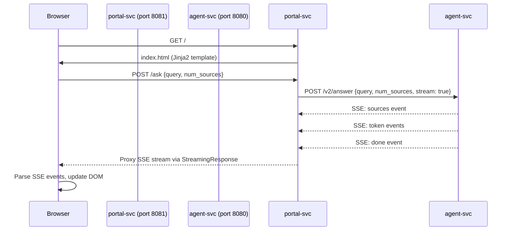
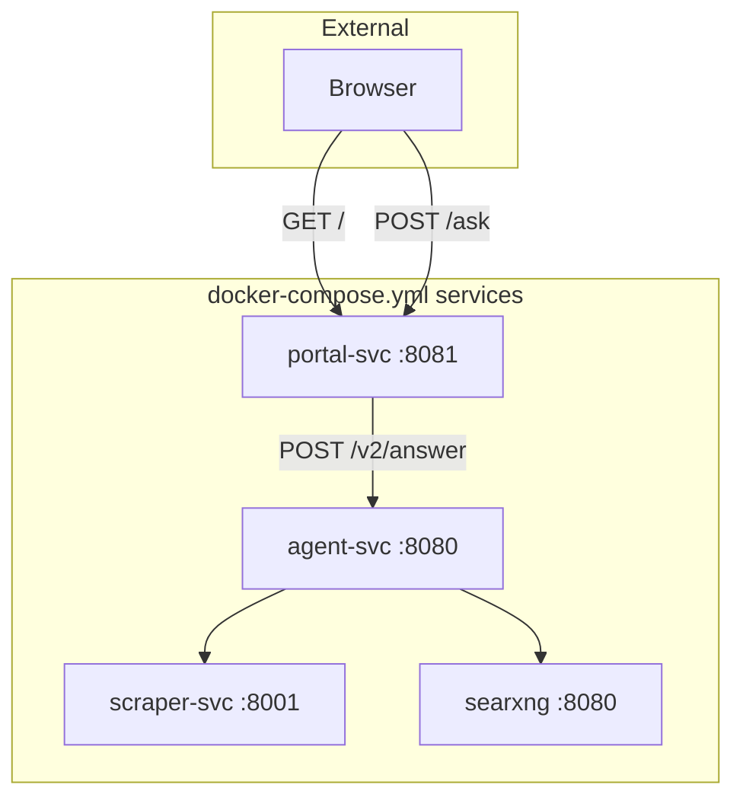

# Web Portal — Single-Search-Bar UI for GroktoCrawl

* Status: accepted
* Deciders: magnus, jasper
* Date: 2026-06-06
* ADR: 0021

Technical Story: GroktoCrawl has a rich API surface and CLI, but no browser-based interface for human users. A lightweight web portal makes the service accessible as a personal research tool — like a self-hosted Perplexity.

## Context and Problem Statement

GroktoCrawl currently has two interaction modes:

| Mode | Interface | Latency | Use Case |
|---|---|---|---|
| **API** | HTTP endpoints | Programmatic | Agent tool calls, SDK usage |
| **CLI** | `groktocrawl` commands | Developer | Terminal research, scripting |

Both require technical fluency. There is no way for a non-technical user (or a technical user who wants a quick search without opening a terminal) to benefit from GroktoCrawl's capabilities.

A web portal fills this gap — a single search bar that routes to the existing `POST /v2/answer` (grounded Q&A, 1-3s synchronous SSE streaming) and eventually `POST /v2/agent` (deep research, async with SSE streaming via issue #130).

## Decision Drivers

* Must be a **new `portal-svc` container** in the existing Docker Compose stack — consistent with the existing service-per-directory architecture
* Must **reuse existing API endpoints** — no new backend logic. The portal is a thin HTTP proxy over `POST /v2/answer`
* Must be **lightweight** — no build step, no JS framework, no database. FastAPI + Jinja2 + HTMX (or plain JS for SSE)
* Must be **zero-ceremony** — no auth, no config UI, no admin panel. Works out of the box when the stack is up
* Must support **SSE streaming** — the answer endpoint already supports `stream: true`, the portal pipes that directly to the browser
* Must feel **instant** — the search bar is the entire interface. Type a question, press Ask, see results stream in

## Considered Options

### A. FastAPI + Jinja2 + EventSource JS *(chosen)*

A single-page portal with a FastAPI backend that proxies POST /v2/answer with SSE streaming directly to the browser.

**Positive:**
- No build step — Jinja2 templates are served directly
- Native SSE streaming via FastAPI StreamingResponse — proxy answer endpoint's event stream directly to the browser
- Familiar pattern — matches how every other service in the stack works
- No JS framework overhead — ~50 lines of vanilla JS for EventSource handling
- localStorage for recent queries adds persistence with zero server-side state

**Negative:**
- Not a progressive web app — no offline support
- SSE requires fetch() ReadableStream rather than EventSource (since the answer endpoint uses POST+SSE, not GET+SSE)
- The portal is tightly coupled to the answer endpoint's SSE event schema

### B. React SPA with API proxy

A separate React application with a dedicated API proxy layer.

**Positive:**
- Richer UI capabilities, component library
- Build tooling (Vite) enables hot reload during development

**Negative:**
- Adds a build step and node_modules — contradicts the "lightweight" goal
- Requires Nginx or similar to serve the SPA and proxy API calls
- Overhead for a single-page search interface
- Introduces a JS framework that none of the other services use

### C. Extend an existing service (e.g., agent-svc) to serve HTML

Add a Jinja2 template and HTML endpoint to the existing agent-svc.

**Positive:**
- No new container — zero infrastructure overhead
- Easy access to all backend state

**Negative:**
- Mixes concerns — agent-svc is an API server, not a web app
- Template files clutter the API service directory
- The API auth middleware (verify_api_key) applies to all routes, including the portal
- Portal users would need to authenticate even in local development

## Decision Outcome

Chosen option: **A. FastAPI + Jinja2 + plain JS EventSource.**

The portal is a new `portal-svc` container with its own Dockerfile, pyproject.toml, and directory. It is a stateless HTTP proxy that accepts browser requests, calls `POST /v2/answer` on agent-svc (over the Docker internal network), and streams the SSE response back to the browser.

### Key Design Decisions

- **POST-based SSE:** The answer endpoint uses POST+SSE (not GET+EventSource). The browser reads the stream via `fetch()` with `response.body.getReader()`, decoding SSE events as they arrive. This avoids needing a separate GET endpoint for EventSource compatibility.
- **Single template:** One Jinja2 template (`index.html`) with inline CSS and ~80 lines of JS. No separate CSS or JS files.
- **No auth in the portal:** The portal container does not authenticate. It accesses agent-svc over the internal Docker network, which is unrestricted. The agent-svc's `verify_api_key` middleware applies only to external-facing routes.
- **Recent queries:** Browser-side localStorage only. No server-side query persistence.
- **Layout reservation for v0.2:** The second button slot ("deep research") exists as empty layout space in the HTML and CSS. It is NOT a disabled control (research shows disabled buttons are perceived as "broken" not "coming soon" — Nielsen Norman Group, McGrenere & Moore 2000).

### Architecture

### SSE Event Schema (proxied from answer endpoint)

The `POST /v2/answer` endpoint emits four event types when `stream: true`. The portal-svc proxies these directly:

| Event | Purpose | Fields |
|---|---|---|
| `sources` | Sources discovered | `sources: [{url, title, relevance}]` |
| `token` | Individual answer tokens | `content: string` |
| `done` | Final answer with citations | `answer, citations, latency_ms` |
| `error` | Pipeline failure | `content: string` |

### Container Details

- **Base image:** `python:3.13-slim`
- **Dependencies:** fastapi, uvicorn, httpx, jinja2, aiofiles
- **Internal port:** 8081
- **External port:** 8081 (mapped in docker-compose.yml)
- **Health check:** GET /health (always returns 200 when portal-svc is up)
- **No env_file needed** — only dependency is knowing agent-svc's internal URL (defaults to http://agent-svc:8080)

### Positive Consequences

* Non-technical users can benefit from GroktoCrawl through a browser
* Fast, streaming answers with source citations — feels like a real product
* Zero new backend infrastructure — reuses the existing answer endpoint
* Follows existing service patterns (Dockerfile, pyproject.toml, Python package)
* No database, no auth, no state management — the portal is stateless

### Negative Consequences

* The portal is tightly coupled to the answer endpoint's SSE event schema — if the schema changes, the portal's event parser needs updating
* v0.1 only supports quick answers (answer endpoint). Deep research (agent endpoint) requires issue #130
* No query history beyond the current browser's localStorage — closing the tab loses all history
* Not suitable for multi-user deployments — no isolation, no rate limiting per user

## Risks and Mitigations

| Risk | Likelihood | Impact | Mitigation |
|---|---|---|---|
| Answer endpoint SSE schema changes | Low | Portal breaks silently | Pin the expected schema version in the portal code. Integration tests catch drift. |
| Browser closes tab mid-stream | Medium | Partial answer lost | Not a data loss scenario — the answer was not persisted anyway. User re-asks. |
| Portal becomes a maintenance burden | Medium | Developer time diverted | Scoped to a single template and route handler. ~200 lines total. Easy to deprecate if unmaintained. |
| agent-svc URL changes | Low | Portal cannot reach answer endpoint | URL configurable via `AGENT_BASE_URL` env var with sensible default. |

## Links

* Issue #131 — Feature request: Web portal
* Issue #130 — Agent SSE streaming (v0.2 dependency)
* ADR-0017 — Grounded Q&A endpoint with SSE streaming (the endpoint this portal proxies)
* Council outputs — `/tmp/hermes-council/jasper-council/35da91af317e/`
