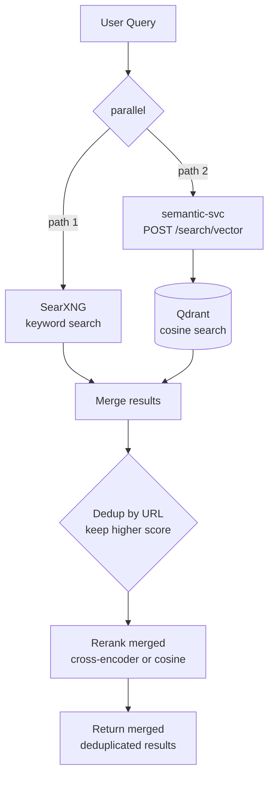
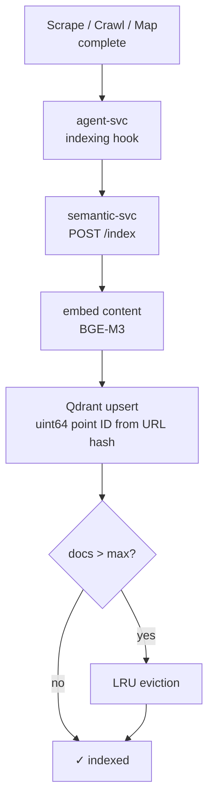

# Phase 2 Semantic Search — Persistent Vector Index

* Status: proposed
* Deciders: magnus, jasper
* Date: 2026-06-09

Technical Story: Phase 1 (ADR-0025) added ad-hoc semantic reranking by embedding SearXNG results on the fly. This improved ranking but cannot surface URLs SearXNG didn't find — every page GroktoCrawl has ever scraped is invisible to search. Phase 2 adds a persistent vector index so the crawl corpus becomes searchable, turning GroktoCrawl into a learning search engine.

## Context and Problem Statement

Phase 1's pipeline is:

```
Query → SearXNG → scrape top N → embed → cosine rerank → return
```

The gap: if SearXNG doesn't return a URL, the semantic reranker never sees it. A page scraped last week about "self-hosted monitoring" won't appear in today's search for "web infrastructure monitoring" unless SearXNG happens to rank it highly — even though the page is the most semantically relevant result in the entire crawl corpus.

Additionally, the answer endpoint (`/v2/answer`) uses raw SearXNG ranking for source selection. It cannot benefit from the semantic understanding of which sources are most relevant to the query.

The fix is a persistent vector index: every time GroktoCrawl scrapes, crawls, or maps a page, embed the content and store it. On search, query the vector index in parallel with SearXNG. The index captures the project's accumulated knowledge; SearXNG provides breadth.

## Decision Drivers

* Must be **self-hosted** — no external vector DB service
* Must support **concurrent reads and writes** — scraping jobs index while search queries read
* Must be **async-native** — agent-svc is async FastAPI; blocking calls degrade latency for all routes
* Must **reuse Phase 1 infrastructure** — semantic-svc already has BGE-M3 loaded; the index lives alongside it
* Must be **opt-in and backward compatible** — `retrieval_mode` defaults to `keyword`; Phase 1 modes unchanged
* Must have a **configurable storage budget** — default 250K documents, adjustable via env var
* Must **persist across container restarts** — Qdrant data survives `docker compose down`

## Considered Options

### A. Qdrant with eager indexing, URL dedup, retrieval_mode extension *(chosen)*

**Vector DB:** Qdrant — single Rust binary Docker container, async-native Python client, purpose-built for concurrent vector operations. No SQLite bottleneck.

**Indexing:** Eager. Every scrape, crawl, and map result is immediately embedded via semantic-svc and stored in Qdrant. The index is always current. Indexing cost (~100ms per document) is negligible compared to the scrape itself (1-5s).

**API surface:** Extend `retrieval_mode` on `SearchRequest` with two new values:

| Mode | Pipeline | Latency |
|---|---|---|
| `keyword` | SearXNG only (unchanged) | <1s |
| `semantic` | SearXNG → scrape → embed → cosine rerank (unchanged) | 1-30s |
| `hybrid` | SearXNG → scrape → cross-encoder merge (unchanged) | 2-40s |
| `vector` | Qdrant only → embed query → vector search → return | <1s |
| `hybrid_vector` | SearXNG + Qdrant in parallel → merge → rerank | 1-30s |

**Deduplication:** URL as key. Same URL in both SearXNG and vector results → keep higher score, drop duplicate. Deterministic, fast, catches the common case.

**Storage budget:** Default 250K documents (~1GB at 1024-dim). Configurable via `VECTOR_INDEX_MAX_DOCS`. When cap is hit, least-recently-accessed documents are evicted. No smarter retention policy in Phase 2 — that's Phase 3 territory.

**Architecture:**

```
                         ┌──────────────────┐
                         │   agent-svc      │
                         └───┬────┬────┬────┘
                             │    │    │
                  ┌──────────┘    │    └──────────┐
                  ▼               ▼               ▼
        ┌──────────────┐ ┌──────────────┐ ┌──────────────┐
        │   searxng    │ │ semantic-svc │ │   qdrant     │
        │   (keyword)  │ │              │ │  (Rust bin)  │
        └──────────────┘ │ POST /embed  │ │  port 6333   │
                         │ POST /rerank │ │  port 6334   │
                         │ POST /index  │ │              │
                         │ POST /search │ │  persistence │
                         │  /vector     │ │  via volume   │
                         │ DELETE /index│ └──────────────┘
                         │ GET  /index  │
                         │  /stats      │
                         └──────────────┘
```

**New semantic-svc endpoints:**

| Endpoint | Method | Input | Output |
|---|---|---|---|
| `/index` | POST | `{"url": "...", "title": "...", "content": "..."}` | `{"status": "indexed"}` |
| `/search/vector` | POST | `{"query": "...", "limit": 5}` | `{"results": [{"url", "title", "score"}]}` |
| `/index/{url_hash}` | DELETE | — | `{"status": "deleted"}` |
| `/index/stats` | GET | — | `{"total_docs": N, "max_docs": 250000}` |

**Positive:**
- Qdrant handles concurrent reads/writes natively — no write queue needed
- Async Python client matches agent-svc's FastAPI architecture
- Eager indexing means search is always fast (no deferred embedding at query time)
- URL dedup prevents the most common duplication without expensive content comparison
- Reuses Phase 1's semantic-svc and BGE-M3 — no new model dependency
- Single Qdrant binary, ~50MB, minimal operational overhead

**Negative:**
- New Docker service (qdrant) — one more container to deploy and monitor
- Index grows unboundedly until cap is reached (~1GB at 250K docs)
- LRU eviction is crude — documents accessed recently as part of a batch scrape may crowd out rarely-accessed but high-value pages
- No content-based dedup — same article at two URLs gets two index entries
- Qdrant is new to the stack — team needs to learn its operational characteristics

### B. Chroma (embedded)

Embed Chroma directly in semantic-svc. No new Docker container.

**Positive:**
- Zero new infrastructure — Chroma is a Python package
- Simpler deployment

**Negative:**
- **SQLite under the hood** — single-writer locking. During concurrent scrapes indexing 50+ pages, writes contend. Search queries block behind writes.
- **Synchronous client only** — every call needs `run_in_executor()` or blocks the event loop. Agent-svc is async; blocking calls degrade latency for all concurrent requests.
- Would require building a write queue + thread pool wrapper to work around the architecture — more code than adding a Qdrant container.
- Rejected: Chroma's concurrency model is incompatible with GroktoCrawl's workload pattern (concurrent scrapes + search queries).

### C. pgvector (PostgreSQL extension)

Add a PostgreSQL container with pgvector extension.

**Positive:**
- Battle-tested database with mature tooling
- SQL for metadata queries alongside vector search

**Negative:**
- Heavier than Qdrant (full PG server vs single Rust binary)
- Operational complexity (migrations, connection pooling, vacuum)
- The stack doesn't use PostgreSQL elsewhere — adding a full RDBMS for one feature is architectural bloat
- Rejected: Qdrant is purpose-built for this use case with lower operational cost.

## Decision Outcome

Chosen option: **A. Qdrant with eager indexing, URL dedup, retrieval_mode extension.**

### Deployment

**docker-compose.yml:**
```yaml
qdrant:
  image: qdrant/qdrant:latest
  restart: unless-stopped
  volumes:
    - qdrant_data:/qdrant/storage

semantic-svc:
  # ... existing ...
  environment:
    - QDRANT_URL=http://qdrant:6333
```

**semantic-svc/pyproject.toml** adds `qdrant-client>=1.13`.

**agent-svc/.env.sample** adds `VECTOR_INDEX_MAX_DOCS=250000`.

**Qdrant collection:** Single collection `groktocrawl_pages` with 1024-dim vectors (BGE-M3), cosine distance, `url` as payload field for dedup lookups.

### Indexing Flow

```
Scrape complete → agent-svc calls semantic-svc POST /index
    → semantic-svc embeds content via BGE-M3
    → semantic-svc upserts into Qdrant (uint64 point ID from SHA-256 URL hash)
    → LRU eviction if index exceeds max_docs
```

### Search Flow (vector mode)

```
Query → semantic-svc POST /search/vector
    → embed query via BGE-M3
    → Qdrant search (cosine distance, top-k)
    → return {url, title, score}
```

### Search Flow (hybrid_vector mode)

```
Query → SearXNG search (parallel) + Qdrant search (parallel)
    → merge results by URL (dedup: keep higher score)
    → rerank merged results via cross-encoder or cosine
    → return merged, deduplicated, reranked results
```

### Positive Consequences

* Crawl corpus becomes searchable — the more you use GroktoCrawl, the better search gets
* Vector search is fast (<1s, no scraping needed)
* Concurrent-safe — no write contention between indexing and search
* Answer endpoint can use reranked sources for better grounded Q&A
* Backward compatible — all existing modes unchanged

### Negative Consequences

* New Docker service (qdrant) to deploy and monitor
* Index growth: ~4KB per document (1024-dim float32), 250K docs = ~1GB
* LRU eviction may drop valuable documents accessed infrequently
* No content-based dedup — different URLs for the same article get separate entries

### Risks

* **Qdrant operational unfamiliarity:** Team hasn't run Qdrant before. Mitigated: Qdrant is a single binary with REST + gRPC APIs, health endpoint, and Prometheus metrics. Documentation is excellent.
* **RAM pressure:** Qdrant loads vectors into memory for search. At 250K docs × 1024-dim × 4 bytes = ~1GB. hal2000 needs this headroom alongside existing services (~8GB total with BGE-M3 + Qdrant + SearXNG + others).
* **Indexing during high-throughput crawls:** A crawl of 500 pages generates 500 index writes. Qdrant handles this fine (it's designed for batch ingestion), but the scrape latency increase is per-document (~100ms embedding time). Mitigated: indexing is fire-and-forget — failed index writes don't block the scrape job.
* **URL as point ID collisions:** Qdrant uses point IDs for upserts. SHA-256 URL hash truncated to uint64 means re-scraping the same URL updates the existing vector rather than creating a duplicate. Good for staleness, but means the `indexed_at` timestamp updates each time. Hash truncation collision risk is 1 in 2^64 — negligible for this index size.

## Implementation Scope (This PR)

**In scope:**
- New `qdrant` Docker service with persistence volume
- semantic-svc: `/index`, `/search/vector`, `/index/{url_hash}`, `/index/stats` endpoints
- semantic-svc: Qdrant client, collection initialization, LRU eviction
- agent-svc: indexing hook in worker.py (after scrape/crawl/map)
- agent-svc: `vector` and `hybrid_vector` retrieval_mode handling
- agent-svc: parallel SearXNG + Qdrant query with URL dedup for `hybrid_vector`
- docker-compose.yml: qdrant service, volume, semantic-svc QDRANT_URL
- `.env.sample`: `VECTOR_INDEX_MAX_DOCS=250000`
- ADR-0026 (this document)

**Out of scope (Phase 3):**
- Content-based deduplication
- Smarter retention policies (domain-based TTLs, crawl-frequency weighting)
- Index analytics dashboard
- gRPC optimization for batch ingestion
- Automatic index rebuild after embedding model upgrade

## Links

* Issue: [#144](https://github.com/groktopus/groktocrawl/issues/144)
* Phase 1: [ADR-0025](0025-semantic-search-pipeline.md), PR #142
* Qdrant: [qdrant.tech](https://qdrant.tech/) (Apache 2.0)
* Reference architecture: Exa API 2.0 ([exa.ai/blog/exa-api-2-0](https://exa.ai/blog/exa-api-2-0))
* Related ADRs: [ADR-0025](0025-semantic-search-pipeline.md), [ADR-0013](0013-search-architecture-with-vertical-categories.md)### Architecture

```mermaid
flowchart TD
    A[agent-svc]
    S[SearXNG<br/>keyword search]
    E[semantic-svc<br/>embed / rerank / index]
    Q[(Qdrant<br/>vector DB<br/>persistent volume)]

    A -->|existing| S
    A -->|embed & search| E
    E -->|qdrant-client<br/>async| Q
    
    subgraph Phase 1 [Phase 1 — existing]
        E1[POST /embed]
        E2[POST /rerank]
    end
    
    subgraph Phase 2 [Phase 2 — new]
        E3[POST /index]
        E4[POST /search/vector]
        E5[DELETE /index/:url_hash]
        E6[GET /index/stats]
    end
    
    E -.-> Phase 1
    E -.-> Phase 2
```

### Search Flow — vector mode

```mermaid
flowchart TD
    Q[User Query] --> SVC[semantic-svc<br/>POST /search/vector]
    SVC --> EMB[embed query<br/>BGE-M3]
    EMB --> QDR[(Qdrant<br/>cosine search)]
    QDR --> TOP[return top-K results<br/>with scores]
    TOP --> RESP[{url, title, score}]
```

### Search Flow — hybrid_vector mode



### Indexing Flow



**New semantic-svc endpoints:**

| Endpoint | Method | Input | Output |
|---|---|---|---|
| `/index` | POST | `{"url": "...", "title": "...", "content": "..."}` | `{"status": "indexed"}` |
| `/search/vector` | POST | `{"query": "...", "limit": 5}` | `{"results": [{"url", "title", "score"}]}` |
| `/index/{url_hash}` | DELETE | — | `{"status": "deleted"}` |
| `/index/stats` | GET | — | `{"total_docs": N, "max_docs": 250000}` |

**Positive:**
- Qdrant handles concurrent reads/writes natively — no write queue needed
- Async Python client matches agent-svc's FastAPI architecture
- Eager indexing means search is always fast (no deferred embedding at query time)
- URL dedup prevents the most common duplication without expensive content comparison
- Reuses Phase 1's semantic-svc and BGE-M3 — no new model dependency
- Single Qdrant binary, ~50MB, minimal operational overhead

**Negative:**
- New Docker service (qdrant) — one more container to deploy and monitor
- Index grows unboundedly until cap is reached (~1GB at 250K docs)
- LRU eviction is crude — documents accessed recently as part of a batch scrape may crowd out rarely-accessed but high-value pages
- No content-based dedup — same article at two URLs gets two index entries
- Qdrant is new to the stack — team needs to learn its operational characteristics

### B. Chroma (embedded)

Embed Chroma directly in semantic-svc. No new Docker container.

**Positive:**
- Zero new infrastructure — Chroma is a Python package
- Simpler deployment

**Negative:**
- **SQLite under the hood** — single-writer locking. During concurrent scrapes indexing 50+ pages, writes contend. Search queries block behind writes.
- **Synchronous client only** — every call needs `run_in_executor()` or blocks the event loop. Agent-svc is async; blocking calls degrade latency for all concurrent requests.
- Would require building a write queue + thread pool wrapper to work around the architecture — more code than adding a Qdrant container.
- Rejected: Chroma's concurrency model is incompatible with GroktoCrawl's workload pattern (concurrent scrapes + search queries).

### C. pgvector (PostgreSQL extension)

Add a PostgreSQL container with pgvector extension.

**Positive:**
- Battle-tested database with mature tooling
- SQL for metadata queries alongside vector search

**Negative:**
- Heavier than Qdrant (full PG server vs single Rust binary)
- Operational complexity (migrations, connection pooling, vacuum)
- The stack doesn't use PostgreSQL elsewhere — adding a full RDBMS for one feature is architectural bloat
- Rejected: Qdrant is purpose-built for this use case with lower operational cost.

## Decision Outcome

Chosen option: **A. Qdrant with eager indexing, URL dedup, retrieval_mode extension.**

### Deployment

**docker-compose.yml:**
```yaml
qdrant:
  image: qdrant/qdrant:latest
  restart: unless-stopped
  volumes:
    - qdrant_data:/qdrant/storage

semantic-svc:
  # ... existing ...
  environment:
    - QDRANT_URL=http://qdrant:6333
```

**semantic-svc/pyproject.toml** adds `qdrant-client>=1.13`.

**agent-svc/.env.sample** adds `VECTOR_INDEX_MAX_DOCS=250000`.

**Qdrant collection:** Single collection `groktocrawl_pages` with 1024-dim vectors (BGE-M3), cosine distance, `url` as payload field for dedup lookups.

### Indexing Flow

```
Scrape complete → agent-svc calls semantic-svc POST /index
    → semantic-svc embeds content via BGE-M3
    → semantic-svc upserts into Qdrant (uint64 point ID from SHA-256 URL hash)
    → LRU eviction if index exceeds max_docs
```

### Search Flow (vector mode)

```
Query → semantic-svc POST /search/vector
    → embed query via BGE-M3
    → Qdrant search (cosine distance, top-k)
    → return {url, title, score}
```

### Search Flow (hybrid_vector mode)

```
Query → SearXNG search (parallel) + Qdrant search (parallel)
    → merge results by URL (dedup: keep higher score)
    → rerank merged results via cross-encoder or cosine
    → return merged, deduplicated, reranked results
```

### Positive Consequences

* Crawl corpus becomes searchable — the more you use GroktoCrawl, the better search gets
* Vector search is fast (<1s, no scraping needed)
* Concurrent-safe — no write contention between indexing and search
* Answer endpoint can use reranked sources for better grounded Q&A
* Backward compatible — all existing modes unchanged

### Negative Consequences

* New Docker service (qdrant) to deploy and monitor
* Index growth: ~4KB per document (1024-dim float32), 250K docs = ~1GB
* LRU eviction may drop valuable documents accessed infrequently
* No content-based dedup — different URLs for the same article get separate entries

### Risks

* **Qdrant operational unfamiliarity:** Team hasn't run Qdrant before. Mitigated: Qdrant is a single binary with REST + gRPC APIs, health endpoint, and Prometheus metrics. Documentation is excellent.
* **RAM pressure:** Qdrant loads vectors into memory for search. At 250K docs × 1024-dim × 4 bytes = ~1GB. hal2000 needs this headroom alongside existing services (~8GB total with BGE-M3 + Qdrant + SearXNG + others).
* **Indexing during high-throughput crawls:** A crawl of 500 pages generates 500 index writes. Qdrant handles this fine (it's designed for batch ingestion), but the scrape latency increase is per-document (~100ms embedding time). Mitigated: indexing is fire-and-forget — failed index writes don't block the scrape job.
* **URL as point ID collisions:** Qdrant uses point IDs for upserts. SHA-256 URL hash truncated to uint64 means re-scraping the same URL updates the existing vector rather than creating a duplicate. Good for staleness, but means the `indexed_at` timestamp updates each time. Hash truncation collision risk is 1 in 2^64 — negligible for this index size.

## Implementation Scope (This PR)

**In scope:**
- New `qdrant` Docker service with persistence volume
- semantic-svc: `/index`, `/search/vector`, `/index/{url_hash}`, `/index/stats` endpoints
- semantic-svc: Qdrant client, collection initialization, LRU eviction
- agent-svc: indexing hook in worker.py (after scrape/crawl/map)
- agent-svc: `vector` and `hybrid_vector` retrieval_mode handling
- agent-svc: parallel SearXNG + Qdrant query with URL dedup for `hybrid_vector`
- docker-compose.yml: qdrant service, volume, semantic-svc QDRANT_URL
- `.env.sample`: `VECTOR_INDEX_MAX_DOCS=250000`
- ADR-0026 (this document)

**Out of scope (Phase 3):**
- Content-based deduplication
- Smarter retention policies (domain-based TTLs, crawl-frequency weighting)
- Index analytics dashboard
- gRPC optimization for batch ingestion
- Automatic index rebuild after embedding model upgrade

## Links

* Issue: [#144](https://github.com/groktopus/groktocrawl/issues/144)
* Phase 1: [ADR-0025](0025-semantic-search-pipeline.md), PR #142
* Qdrant: [qdrant.tech](https://qdrant.tech/) (Apache 2.0)
* Reference architecture: Exa API 2.0 ([exa.ai/blog/exa-api-2-0](https://exa.ai/blog/exa-api-2-0))
* Related ADRs: [ADR-0025](0025-semantic-search-pipeline.md), [ADR-0013](0013-search-architecture-with-vertical-categories.md)
