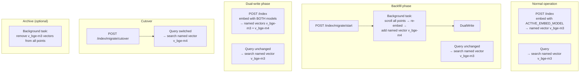

# Embedding Model Migration Path for Index Rebuilds

* Status: proposed
* Deciders: magnus, jasper
* Date: 2026-06-08

Technical Story: When the embedding model is upgraded (e.g., BGE-M3 → BGE-M4, E5-Mistral, custom fine-tune), all 250K+ vectors in the index become incompatible. Without a migration path, the entire index must be dropped and rebuilt from scratch — losing all accumulated pages, retention metadata, and access history.

## Context and Problem Statement

GroktoCrawl's vector index (ADR-0026) currently assumes a single embedding model for the life of the collection. The model is hardcoded in `semantic-svc/app.py` as `EMBED_MODEL_NAME = "BAAI/bge-m3"` with `EMBED_DIM = 1024`. When creating the Qdrant collection, the vector size is fixed to this dimension.

Three failure modes:

1. **Model upgrade = index loss.** BGE-M4, E5-Mistral, or a custom fine-tune will produce vectors in a different embedding space. Existing 250K vectors cannot be searched with the new model — cosine similarity across different embedding spaces is meaningless. The only option today is to drop the Qdrant collection and rebuild from scratch.

2. **No audit trail.** There is no per-document record of which embedding model was used. If different pages were indexed under different models (e.g., during a staged rollout), there's no way to distinguish them at query time.

3. **No rollback safety.** If a new model produces worse search results, reverting means dropping the index again. There is no archive of old vectors.

## Decision Drivers

- Must allow **zero-downtime migration** — search queries continue to work during backfill
- Must support **rollback** — old vectors must be recoverable without re-indexing
- Must **not require infrastructure changes** — no new Docker services, workers, or databases
- Must be **backward compatible** — existing index pages without model metadata get default values
- Must be **monitorable** — migration progress (docs processed / total) must be queryable
- Must survive **container restarts** — migration state persists across restarts

## Considered Options

### A. Qdrant named vectors + Valkey migration state *(chosen)*

**How it works:**

Qdrant supports named vectors — each point can carry multiple vectors identified by name. A point indexed under BGE-M3 carries a `bge-m3` named vector. During migration, the same point also gets a `bge-m4` named vector. Queries specify which named vector to search.

**Payload enrichment:** Every indexed point gains two new payload fields:

| Field | Type | Example | Description |
|---|---|---|---|
| `embedding_model` | string | `"BAAI/bge-m3"` | Model ID that produced this point's active named vector |
| `embedding_dim` | int | `1024` | Vector dimension of that model |
| `embedding_models` | list[string] | `["BAAI/bge-m3", "BAAI/bge-m4"]` | History of all models used for this point |

**Migration state** (stored in Valkey key `semantic:migration`):

```json
{
  "status": "idle | backfilling | cutover | complete",
  "source_model": "BAAI/bge-m3",
  "target_model": "BAAI/bge-m4",
  "source_dim": 1024,
  "target_dim": 2048,
  "docs_processed": 0,
  "docs_total": 250000,
  "started_at": "2026-06-08T20:00:00Z",
  "completed_at": null
}
```

**Endpoints:**

| Endpoint | Method | Description |
|---|---|---|
| `/index/model` | GET | Current active model, dimension, and migration state |
| `/index/migrate/start` | POST | Start a migration to a new model; takes `{target_model, target_dim}` |
| `/index/migrate/status` | GET | Migration progress (docs processed / total, status, eta) |

**Migration lifecycle:**

1. **Backfill phase** — POST `/index/migrate/start` with `{target_model: "BAAI/bge-m4", target_dim: 2048}`. A background task scrolls all points, re-embeds each with the new model, and adds a named vector for the new model. During this phase, queries continue using the old named vector (`bge-m3`). Migration state tracks progress.

2. **Dual-write phase** — After backfill reaches 100%, new index requests embed with BOTH models and add both named vectors. Queries still use the old model.

3. **Cutover phase** — POST `/index/migrate/cutover` switches the active default query vector to the new model. The old named vector is retained on points (not deleted) — queries can explicitly request `model=bge-m3` for rollback testing.

4. **Completion** — Old vectors can be archived (removed from points, not deleted). If `ARCHIVE_OLD_VECTORS=true`, a background task strips the old model's named vectors from all points. This is optional and can be deferred indefinitely.

**Named vector naming convention:** `v_{model_short}` — e.g., `v_bge-m3`, `v_bge-m4`, `v_e5-mistral-7b`. The active model's short name is stored in the environment as `ACTIVE_EMBED_MODEL` (default: `bge-m3`), so all query and index endpoints know which named vector to use.

**Architecture:**



**Collection creation:** On startup, `_ensure_qdrant()` accepts a `model_name` and `model_dim` parameter. If the collection exists, it validates the vector size matches. If not, it creates the collection with the configured dimension. The model name is validated against supported models (list maintained in `semantic-svc/app.py`).

**New env vars:**

| Variable | Default | Description |
|---|---|---|
| `EMBED_MODEL_NAME` | `BAAI/bge-m3` | HuggingFace model ID for embedding |
| `EMBED_DIM` | `1024` | Vector dimension (must match model) |
| `ACTIVE_EMBED_MODEL` | `bge-m3` | Active named vector for search queries |

**Positive:**
- Qdrant named vectors are the native solution — no hacks, no dual collections, no data duplication
- Migration state survives restarts (Valkey persists independently)
- Zero-downtime migration — queries never block
- Rollback is instant — queries can target `v_bge-m3` at any time
- Named vectors on the same point means payload metadata is never duplicated
- Backward compatible — existing points without `embedding_model`/`embedding_dim` get default values
- No new Docker services — Valkey already exists in the stack

**Negative:**
- Named vectors increase storage: two 1024-dim vectors per point ≈ 8KB per document instead of 4KB
- Migration backfill takes time (~250K docs × ~100ms per embed ≈ 7 hours for BGE-M3 on CPU)
- Valkey migration state is a single point of truth — if Valkey is wiped, migration progress is lost
- Collection creation must match the configured dimension; changing dim requires migration

### B. Per-model Qdrant collections

Each model gets its own collection (`groktocrawl_pages_bge_m3`, `groktocrawl_pages_bge_m4`). Search queries the active collection. Migration backfills by embedding and inserting into the new collection.

**Positive:**
- Clean separation — collections are independent, can have different configs
- No named-vector storage overhead
- Easy to archive — just drop the old collection

**Negative:**
- Point ID (URL hash) collision across collections — same URL in both collections, separate storage
- No shared payload metadata — retention scores, access counts must be copied or tracked per-collection
- Search queries must know which collection to target (env var or Valkey key)
- More Qdrant collections = more scroll operations for admin tasks
- New collection naming convention — code must embed the model name in collection references

**Rejected:** Named vectors are simpler for the common case (same set of URLs in both models). Per-model collections add complexity without proportional benefit.

### C. In-place replacement (stop the world)

Stop indexing, re-embed all existing pages, replace vectors in-place.

**Positive:**
- Simplest implementation — no named vectors, no dual-write, no Valkey state
- No storage overhead

**Negative:**
- Downtime: queries return empty results during migration (7+ hours)
- No rollback — old vectors are destroyed
- No audit trail of which model was used
- **Rejected:** Downtime and irreversibility are unacceptable for a production index.

## Decision Outcome

Chosen option: **A. Qdrant named vectors with Valkey migration state.**

### Migration Workflow

```
1. User configures new model:
   EMBED_MODEL_NAME=BAAI/bge-m4
   EMBED_DIM=2048
   ACTIVE_EMBED_MODEL=bge-m4

2. POST /index/migrate/start {target_model, target_dim}
   → Status: backfilling
   → Background task scrolls all points, embeds with new model, adds named vector

3. During backfill:
   → Queries still use ACTIVE_EMBED_MODEL (or old model until cutover)
   → Indexing still uses old model only (dual-write starts after backfill)

4. Backfill complete → status: dual_write
   → New index requests embed with both models
   → Queries still use old model

5. POST /index/migrate/cutover
   → ACTIVE_EMBED_MODEL switches to new model
   → Status: complete

6. (Optional) POST /index/migrate/archive
   → Remove old named vectors from all points
   → Status: archived
```

### Changes Required

**semantic-svc/app.py:**
- Make `EMBED_MODEL_NAME`, `EMBED_DIM`, `ACTIVE_EMBED_MODEL` configurable via env vars
- Add `embedding_model` and `embedding_dim` to index payload
- Add named vector support to `_ensure_qdrant()` — create collection with dim, track named vectors
- Add `GET /index/model` endpoint returning model config + migration state
- Add `POST /index/migrate/start` endpoint
- Add `GET /index/migrate/status` endpoint
- Add `_migrate_backfill()` background task
- Add named vector switching logic for search/index

**agent-svc/agent/semantic_client.py:**
- Add `get_model()` method
- Add `start_migration()` and `migration_status()` methods

**agent-svc/agent/worker.py:**
- No changes if indexing is already fire-and-forget (queries continue to work)

**docker-compose.yml:**
- Add `EMBED_MODEL_NAME`, `EMBED_DIM`, `ACTIVE_EMBED_MODEL` env vars to semantic-svc

**.env.sample:**
- Add new env vars with defaults

### Positive Consequences

* Model upgrades no longer require index rebuilds from scratch
* Rollback is instant — queries can target any named vector at any time
* Audit trail: every point knows which model produced its vector
* Migration progress is observable and monitorable
* Backward compatible — existing points without model metadata get default values

### Negative Consequences

* Named vectors double peak storage during dual-write (~2GB for 250K docs at 1024-dim)
* Migration backfill takes hours for 250K documents
* Valkey migration state is a coordination point — if Valkey is wiped during migration, state is lost
* Additional API surface needs documentation and testing

### Risks

* **Migration time:** 250K docs × 100ms = ~7 hours for BGE-M3 on CPU. Mitigated: backfill runs as a background task; queries are unaffected. Users can throttle or pause migration via the status endpoint.
* **Storage during dual-write:** ~2GB at peak for 250K docs at 1024-dim. Mitigated: storage is configurable via `VECTOR_INDEX_MAX_DOCS`. The additional ~1GB is acceptable within typical Docker volume sizes.
* **Valkey state loss:** If Valkey is wiped mid-migration, `GET /index/model` reports no active migration. Manual restart of migration via `/index/migrate/start` is required. Design accepts this risk — migration is an infrequent operation.

### Links

- [ADR-0026 — Phase 2: Persistent Vector Index](0026-phase2-vector-index.md)
- [ADR-0027 — Smarter Index Retention](0027-smarter-index-retention.md)
- [Qdrant Named Vectors](https://qdrant.tech/documentation/concepts/collections/#named-vectors)
