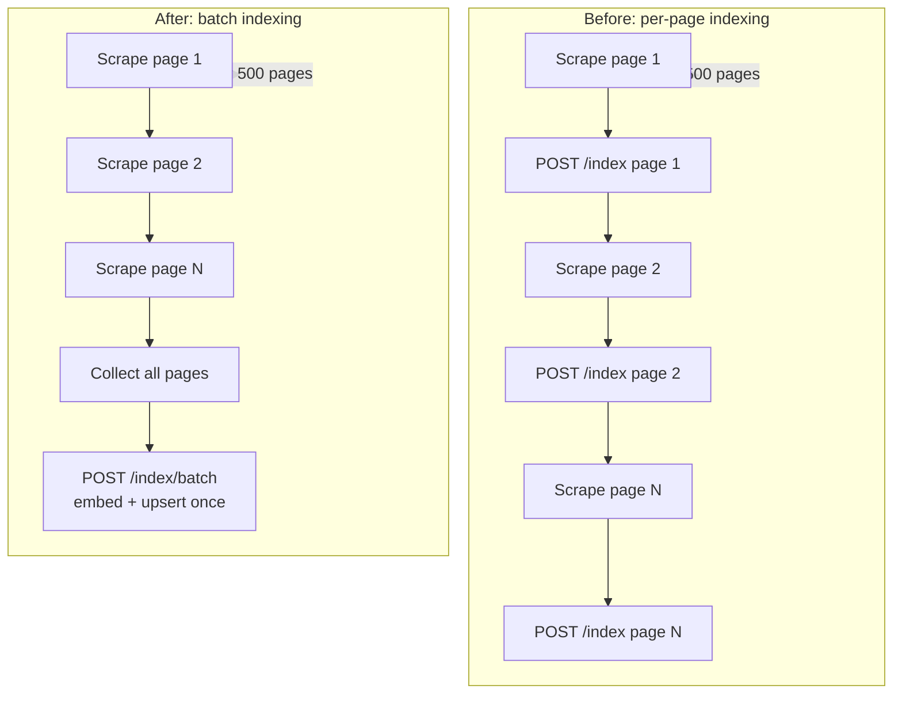

# Batch Vector Ingestion via Qdrant gRPC

* Status: accepted
* Deciders: magnus, jasper
* Date: 2026-06-09

Technical Story: Issue [#154](https://github.com/groktopus/groktocrawl/issues/154)

## Context and Problem Statement

The current indexing pipeline (ADR-0026) fires one `POST /index` call per scraped page. For a 500-page batch scrape or map crawl, this generates 500 sequential HTTP requests to semantic-svc. Each call:

1. HTTP POST overhead (~1ms)
2. Embed content via BGE-M3 (~100ms per document)
3. Upsert to Qdrant via REST API (~1ms each in serial, ~5ms batched)

Total indexing time for a 500-page crawl: ~50 seconds of blocking API calls, plus ~500ms of per-request HTTP overhead.

While indexing is fire-and-forget (failed index writes don't block the scrape), the per-document overhead is wasted latency on both sides — the client spends time managing 500 connections, and the server processes one document at a time through a pipelined but serial-message flow.

Qdrant's gRPC API supports streaming batch upserts (hundreds of vectors in a single RPC). SentenceTransformer's `encode()` method accepts batched inputs with negligible per-document overhead beyond the batch. The gap is the lack of a batch ingestion endpoint in semantic-svc and a batch client method in agent-svc.

## Decision Drivers

* Must reduce indexing time for batch operations by at least 20x
* Must be backward compatible — existing per-page `/index` endpoint unchanged
* Must remain best-effort — batch indexing failures must not block scrape results
* Must reuse existing embedding infrastructure (BGE-M3, Qdrant, qdrant-client)
* Must follow existing service-per-concern architecture
* Must integrate with the existing named-vector and migration infrastructure (ADR-0028)

## Considered Options

### A. Batch endpoint with aggregated embed + upsert *(chosen)*

Add `POST /index/batch` to semantic-svc accepting `{"pages": [{"url", "title", "content"}, ...]}`. The endpoint:

1. Collects all content texts from the batch
2. Embeds all texts in a single `model.encode()` call (BGE-M3 batch inference)
3. Builds payloads and point IDs for all pages
4. Upserts all points to Qdrant in a single `client.upsert(points=[...])` call (gRPC streaming)
5. Runs eviction check once (not per-page)
6. Returns `{"status": "indexed", "count": N}`

On the agent-svc side, `SemanticClient` gets an `index_batch()` method. The batch scrape and map workers accumulate scraped pages and fire one batch call at the end of the scrape loop instead of N per-page calls.

**Expected performance for 500 pages:**
- Embedding: ~200ms total (BGE-M3 batch: ~100ms base + ~0.2ms per extra doc)
- Upsert: ~50ms total (Qdrant gRPC batch: near-constant for <1000 points)
- HTTP overhead: ~2ms (one POST vs 500)
- Total: ~250ms vs ~50s — **~200x improvement**

**Architecture:**

```
                         ┌──────────────────┐
                         │   agent-svc      │
                         │  batch scrape    │
                         │  collects pages  │
                         └───┬──────────────┘
                             │ POST /index/batch  {"pages": [...]}
                             ▼
                    ┌──────────────────┐
                    │  semantic-svc    │
                    │                  │
                    │  model.encode(   │  ← batched embedding
                    │    [content]*N)  │
                    │        │         │
                    │        ▼         │
                    │  qdrant.upsert(  │  ← gRPC batch upsert
                    │    points=[...])  │
                    │        │         │
                    │        ▼         │
                    │  _evict_if_needed│  ← single eviction check
                    └──────────────────┘
```

**Positive:**
- 200x improvement for batch operations
- Backward compatible — no changes to existing per-page endpoint
- Reuses Qdrant's native gRPC batch support (no custom batch logic needed)
- Single eviction check saves ~500× scroll+score computation
- Named vector and dual-write migration patterns integrate cleanly (batch all pages with active + target model vectors)
- Zero impact on single-page crawl or search flows

**Negative:**
- Shifts timing: pages get indexed at the *end* of the scrape loop, not immediately after each page is scraped. In practice this is fine — no consumer queries the vector index mid-crawl.
- Memory pressure: 500 pages × ~2000 chars content = ~1MB in request body. Acceptable for FastAPI's default body size limit (which we're not changing).
- Failed batch loses all pages rather than one — but indexing is best-effort; a failed batch is no worse than 500 individually failed pages landing in the same second.

### B. Streaming batch (server-sent events)

Pipe each page through semantic-svc via a streaming endpoint that embeds and upserts as each page arrives, without waiting for the full batch.

**Positive:**
- Per-page indexing visibility (could report progress per page)
- Lower peak memory on both sides (stream pages one-at-a-time)

**Negative:**
- More complex protocol (SSE events, connection management)
- Per-page overhead still exists on the server side (one embed call per page in practice unless we buffer)
- Implementing buffering + streaming defeats the purpose — just batch
- Requires changes to agent-svc worker to consume SSE rather than a simple POST
- Rejected: architectural complexity doesn't justify the marginal benefit over simple batch

### C. Accumulate-and-flush in agent-svc (no new endpoint)

Collect pages in agent-svc memory during the scrape loop, then call the existing `/index` endpoint N times in parallel with `asyncio.gather()`.

**Positive:**
- No new endpoint in semantic-svc
- Parallel rather than sequential indexing

**Negative:**
- Still N HTTP connections to semantic-svc
- Still N embeddings (no batch inference)
- Qdrant gRPC batch not utilized — still N individual REST upserts
- Maximum improvement: ~5x (from sequential to concurrent) vs ~200x for true batch
- Rejected: parallelizing the wrong operations doesn't solve the root cause

## Decision Outcome

Chosen option: **A. Batch endpoint with aggregated embed + upsert.**

### Implementation

**semantic-svc/app.py — new model and endpoint:**

```python
class IndexBatchRequest(BaseModel):
    pages: list[IndexRequest]  # reuses existing per-page model

class IndexBatchResponse(BaseModel):
    status: str
    count: int

@app.post("/index/batch", response_model=IndexBatchResponse, status_code=201)
async def index_batch(body: IndexBatchRequest):
    """Embed and store multiple pages in a single batch."""
    qdrant = await _ensure_qdrant()
    model = _get_embed_model()

    if not body.pages:
        return IndexBatchResponse(status="indexed", count=0)

    # Extract content texts for batch embedding
    contents = [p.content[:2000] for p in body.pages]

    # Batch embed all texts in one call
    embeddings = model.encode(contents, normalize_embeddings=True).tolist()

    # Build points
    points = []
    for page, embedding in zip(body.pages, embeddings):
        point_id = _url_hash(page.url)
        existing_payload = None
        try:
            existing = qdrant.retrieve(
                COLLECTION_NAME,
                ids=[point_id],
                with_payload=True,
                with_vectors=False,
            )
            if existing and existing[0].payload:
                existing_payload = existing[0].payload
        except Exception:
            pass

        payload = _build_index_payload(page.url, page.title, existing_payload)
        vectors = {_get_active_model(): embedding}

        # Dual-write support
        if _migration["status"] == "dual_write":
            target_name = _migration["target_model"]
            if target_name:
                try:
                    target_model = SentenceTransformer(target_name)
                    target_embedding = target_model.encode(
                        page.content[:2000], normalize_embeddings=True
                    ).tolist()
                    target_nv = _named_vector_name(target_name)
                    vectors[target_nv] = target_embedding
                    existing_models = json.loads(payload.get("embedding_models", "[]"))
                    for nv in [_get_active_model(), target_nv]:
                        if nv not in existing_models:
                            existing_models.append(nv)
                    payload["embedding_models"] = json.dumps(existing_models)
                except Exception as e:
                    logger.warning("Batch dual-write embed failed: %s", e)

        points.append(models.PointStruct(
            id=point_id,
            vector=vectors,
            payload=payload,
        ))

    # Single batch upsert via Qdrant gRPC
    qdrant.upsert(collection_name=COLLECTION_NAME, points=points)

    await _evict_if_needed(qdrant)

    return IndexBatchResponse(status="indexed", count=len(points))
```

**agent-svc/agent/semantic_client.py — new method:**

```python
async def index_batch(self, pages: list[dict]) -> dict:
    client = await self._ensure_client()
    resp = await client.post(
        f"{self.base_url}/index/batch",
        json={"pages": pages},
    )
    resp.raise_for_status()
    return resp.json()
```

**agent-svc/agent/worker.py — batch scrape change:**

In `_process_batch_scrape_async`, accumulate indexed pages then batch at the end:

```python
# Collect pages that need indexing during the scrape loop
_index_batch = []
for url in urls:
    result = await scraper.scrape(url)
    if result.get("success"):
        data = result["data"]
        pages.append({"url": url, "markdown": data.get("markdown", "")})
        metadata = data.get("metadata") or {}
        og = metadata.get("og") or {}
        meta = metadata.get("meta") or {}
        title = og.get("title") or meta.get("title") or data.get("title", "")
        # Accumulate for batch indexing instead of per-page
        _index_batch.append({
            "url": url,
            "title": title,
            "content": data.get("markdown", "")[:2000],
        })
# Fire one batch index call after all scrapes
if _index_batch:
    asyncio.create_task(_index_batch_async(_index_batch))
```

And a new `_index_batch_async` function:

```python
async def _index_batch_async(pages: list[dict]) -> None:
    """Fire-and-forget index a batch of pages."""
    try:
        from .semantic_client import SemanticClient
        semantic_url = os.getenv("SEMANTIC_URL", "http://semantic-svc:8003")
        client = SemanticClient(semantic_url)
        await client.index_batch(pages)
        await client.close()
        logger.debug("Indexed %d pages in batch", len(pages))
    except Exception:
        logger.debug("Failed to batch-index %d pages", len(pages))
```

### Positive Consequences

* Batch operations (crawl, batch scrape, map) see ~200x reduction in indexing overhead
* Qdrant gRPC batch upsert is near-constant time for <1000 points
* Single eviction check replaces N per-page checks
* Named vector and migration infrastructure work transparently — each page in the batch gets vectors for both active and target models during dual-write
* Zero impact on single-page flows (search, single scrape)

### Negative Consequences

* Slightly increased memory per batch request (~1MB for 500 pages)
* Indexing happens at the end of the scrape loop, not during — pages are briefly unsearchable until the batch fires. Acceptable because no consumer queries mid-crawl.
* A batch failure loses multiple pages' indexing. Mitigated by the fire-and-forget/retry pattern — the batch can be re-fired by the caller.

### Risks

* **RequestBodyTooLarge:** 500 pages × ~2000 chars content = ~1MB. FastAPI default limit is 16MB for uvicorn. No change needed unless batch sizes exceed 8000 pages, which would be a separate scaling concern.
* **Dual-write memory during batch:** If dual-write is active, each page is embedded twice (active + target model). For 500 pages, that's 2 × 500 = 1000 embeddings. The target model is loaded once and reused per call block — BGE-M3 at 2GB can handle this. For very large batches (>5000 pages), consider streaming or breaking into sub-batches.
* **Qdrant gRPC connection handling:** `qdrant-client` already uses gRPC for batch operations when the gRPC port (6334) is available. The current `QdrantClient(url=...)` constructor auto-detects gRPC. No configuration change needed.

## Links

* Issue: [#154](https://github.com/groktopus/groktocrawl/issues/154)
* ADR-0026: [Phase 2 Vector Index](0026-phase2-vector-index.md) — established per-page indexing; batch was out-of-scope (listed as "gRPC optimization for batch ingestion")
* ADR-0028: [Embedding Model Migration Path](0028-embedding-model-migration-path.md) — named vector and dual-write infrastructure reused in batch path
* Qdrant gRPC: [qdrant.tech/documentation/concepts/points/#upload-points](https://qdrant.tech/documentation/concepts/points/#upload-points)

## Mermaid Diagrams

### Architecture Overview

```mermaid
flowchart TD
    A[agent-svc<br/>batch scrape worker] -->|POST /index/batch| S[semantic-svc]
    S -->|model.encode(batch)| EMB[BGE-M3<br/>batch inference]
    EMB -->|vectors[N]| BLD[Build points + payloads]
    BLD -->|upsert(points=[...])| Q[(Qdrant<br/>gRPC batch)]
    Q -->|one check| EVICT[_evict_if_needed]
    EVICT --> RESP[Return {status, count}]
```

### Indexing Flow Comparison


