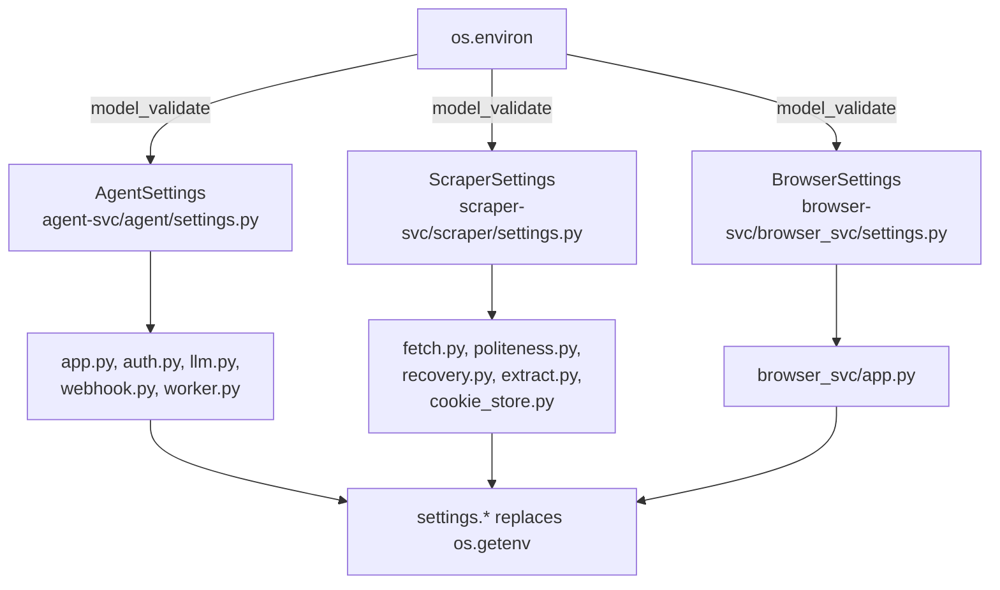

# ADR-0031: Centralized Settings Object for Service Configuration

**Status:** Proposed

**Deciders:** Magnus Hedemark, Jasper (AI Agent)

**Date:** 2026-06-14

## Context

Environment variables are currently loaded with `os.getenv()` scattered across ~18 files across three services (agent-svc, scraper-svc, browser-svc). Each module independently reads and caches its own env vars at import time with no central registry. This creates several failure modes:

- **Implicit import-order dependency** — a module loaded first sets its defaults; later modules cannot co-ordinate
- **No single source of truth** — discovering all env vars requires grepping across the entire codebase
- **No type validation** — env var values are raw strings; `int(os.getenv(...))` fails on non-numeric values with opaque errors
- **Impossible to inject settings for testing** — tests must resort to `mock.patch("os.getenv")` which is fragile
- **Duplicate defaults** — `LLM_BASE_URL` has different defaults in `agent/app.py` vs `scraper/recovery.py`

## Decision Drivers

1. **Zero new dependencies** — the project convention keeps per-service `pyproject.toml` minimal. pydantic is already available via FastAPI, but pydantic-settings must not be added.
2. **Per-service scope** — each service has distinct env vars; a shared settings class across services would merge unrelated concerns.
3. **Backward compatibility** — existing `.env` file structure and env var names must not change.
4. **Testability** — settings must be injectable or overridable without mocking `os.environ`.
5. **Single-load semantics** — settings must be computed once at startup and reused across all modules.

## Considered Options

### Option A: pydantic-settings BaseSettings (rejected)
- Uses the `pydantic-settings` library with `BaseSettings` for automatic `.env` file loading and type coercion.
- **Pros:** Zero manual env var reading; `.env` file and env var priority handled automatically.
- **Cons:** Adds `pydantic-settings>=2.x` dependency; `.env` file is already handled by Docker Compose's `env_file:` directive. The second `.env` read creates confusion about which takes precedence.

### Option B: Per-service pydantic BaseModel with os.environ factory (chosen)
- Each service gets a `settings.py` with a pydantic `BaseModel` subclass. A `load_settings()` factory function decorated with `@functools.cache` reads `os.environ` and returns a frozen Settings instance.
- **Pros:** Zero new dependencies. Type validation via pydantic's `Field(alias=...)`. `functools.cache` guarantees single construction. `model_validate(dict(os.environ))` resolves all aliases in one call.
- **Cons:** Manual mapping from env var names to settings fields. Acceptable — the mapping is mechanical and the `.env.sample` already documents all env vars.

### Option C: Plain dataclass (rejected)
- A `@dataclass` with manual field definitions and `os.environ` reads.
- **Pros:** Even lighter than pydantic BaseModel.
- **Cons:** No type validation. No `model_dump()` for serialization. No `Field()` aliases. pydantic is already available — the extra capability costs nothing in dependency budget.

## Decision

Adopt **Option B: Per-service pydantic BaseModel with os.environ factory**.

Each target service receives:

1. **`agent-svc/agent/settings.py`** — `AgentSettings` covering 13 env vars (LOG_LEVEL, VALKEY_HOST/PORT/DB, SCRAPER_URL, SEARXNG_URL, SEMANTIC_URL, LLM_BASE_URL/API_KEY/MODEL, LLM_ENABLE_THINKING, API_KEY, WEBHOOK_SECRET)
2. **`scraper-svc/scraper/settings.py`** — `ScraperSettings` covering 22 env vars (VALKEY_HOST/PORT/DB, QA_MIN_CONTENT_CHARS/TITLE_CHARS/MAX_BOILERPLATE_RATIO, FLARE_SOLVERR_URL, all SCRAPE_CACHE_* settings, BROWSER_SVC_URL, SCRAPER_PROXY_URL, all POLITENESS_* settings, all RECOVERY_LLM_* settings, QA_MIN_QUALITY_THRESHOLD, SCRAPE_CACHE_DOMAIN_TTLS)
3. **`browser-svc/browser_svc/settings.py`** — `BrowserSettings` covering 2 env vars (VALKEY_HOST, VALKEY_PORT)
4. **`scraper-svc/scraper/settings.py`** also includes a `@field_validator("politeness_enabled", mode="before")` to parse "true"/"1"/"yes" strings to boolean

Each module follows the pattern:

```python
import functools
from pydantic import BaseModel, Field

class ServiceSettings(BaseModel):
    setting_name: str = Field(default="default", alias="ENV_VAR_NAME")

@functools.cache
def load_settings() -> ServiceSettings:
    return ServiceSettings.model_validate(dict(os.environ))
```

## Migration

The replacement is mechanical per `os.getenv()` call:

- Replace import: remove `import os`, add `from .settings import load_settings`
- Replace call: `os.getenv("X", "default")` → `settings.x`
- For module-level constants, call `load_settings()` at module scope — the cache ensures single construction

## Consequences

**Positive:**
- Single source of truth for all env vars, documented as `Field(description=...)` annotations
- Type validation catches misconfigurations at startup instead of at first use
- Tests can inject settings via `mock.patch("module.settings.load_settings")` returning a test object
- All env vars discoverable by reading one file per service

**Neutral:**
- ~30 env vars migrated across ~18 files
- Each replacement is a mechanical transformation — no logic changes

**Negative:**
- Module-level `load_settings()` calls create an implicit dependency on module import order for cached side effects (mitigated by `@functools.cache`)
- `auth.py` retains an explicit `load_settings()` call at module level to set `AUTH_ENABLED` and `API_KEY` before the request handler runs

## Links

- [Issue #186](https://github.com/groktopus/groktocrawl/issues/186)
- PR template: `.github/PULL_REQUEST_TEMPLATE.md`


## Diagrams

### Architecture Overview



### Migration Data Flow

```mermaid
flowchart LR
    A[".env file
(Docker env_file:)"] -->|loaded into| B[os.environ]
    B -->|model_validate| C[load_settings()
@functools.cache]
    C -->|first call| D["Settings object
(pydantic BaseModel)"]
    D -->|subsequent calls| D
    D -->|settings.x| E["Module-level consts
(fetch.py, politeness.py)"]
    D -->|settings.x| F["create_app() startup
(app.py, browser_svc/app.py)"]
    D -->|settings.x| G["Request handlers
(llm.py, auth.py)"]
    H["mock.patch settings
(for tests)"] -.->|test injection| D
```
