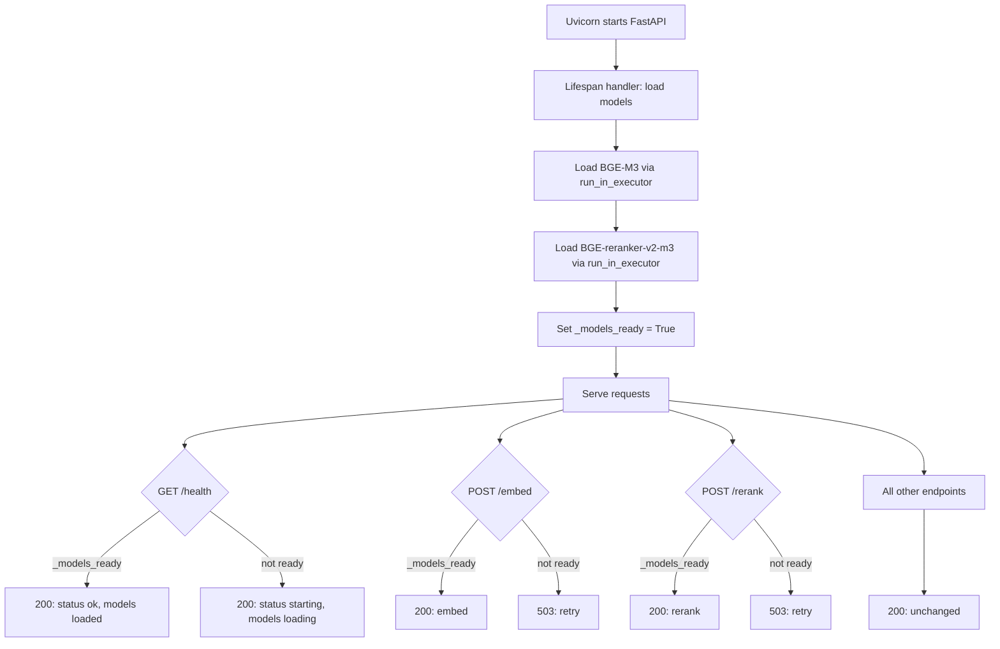

# ADR-0034: Lifespan-Based Model Loading and Startup Readiness for semantic-svc

**Status:** Accepted

**Deciders:** Magnus Hedemark, Jasper (AI Agent)

**Date:** 2026-06-15

## Context

semantic-svc loads two ML models at runtime: `SentenceTransformer` (BGE-M3, ~2GB) and `CrossEncoder` (BGE-reranker-v2-m3, ~200MB). Combined, they require ~2.2GB of RAM and 2-5 seconds to initialize.

Prior to this ADR, models were loaded via lazy initialization in `_get_embed_model()` and `_get_rerank_model()`. The first request to `/embed`, `/rerank`, `/index`, `/search/vector`, or `/index/batch` paid the 2-5 second initialization penalty. Meanwhile, `/health` returned `{"status": "ok"}` unconditionally — even before models were loaded.

This created three problems:

1. **First-request penalty.** The first user request blocks for 2-5 seconds while models load. Docker Compose health checks cannot detect this state.
2. **Orchestrator confusion.** Docker Compose and Kubernetes health probes see 200 OK and route traffic before the service is actually ready.
3. **No visibility.** Without model readiness in the health endpoint, monitoring tools cannot distinguish "service starting" from "service broken."

ADR-0029 (Service-Level Metrics) references `/health` as an existing concept, but at the time of that ADR's writing, `/health` was a stub that returned `{"status": "ok"}` unconditionally — blind to model state.

## Decision Drivers

1. **Scraper-svc precedent.** scraper-svc already uses FastAPI's `lifespan` handler to load adapters and connect to Valkey at startup. semantic-svc should follow the same pattern.
2. **Health check visibility.** Docker Compose health checks must be able to detect model readiness — not just HTTP reachability.
3. **No new dependencies.** The `lifespan` pattern uses only stdlib `contextlib.asynccontextmanager` and existing `run_in_executor` patterns already used in `/embed`.
4. **Graceful failure.** If models fail to load (corrupted cache, OOM, invalid model name), the service should start but report "starting" status — not crash and restart in a loop.
5. **Minimal endpoint changes.** Only `/health`, `/embed`, and `/rerank` change behavior. All other endpoints work identically.

## Considered Options

### Option A: Lifespan-based model loading (chosen)

Move model loading from lazy-init to a `lifespan` handler. Models load during FastAPI startup — before any requests arrive. A `_models_ready` flag tracks state. `/health` reports model readiness. `/embed` and `/rerank` return 503 if models aren't loaded.

**Pros:**
- Follows scraper-svc precedent — consistent project pattern
- `/health` becomes a meaningful readiness check for orchestrators
- First request is fast (models already loaded)
- Zero new dependencies
- Graceful failure — service starts even if model loading fails

**Cons:**
- Service startup takes 2-5 seconds longer (was sub-second)
- If lifespan fails to load models, `/index`, `/search/vector`, and `/index/batch` crash with `AttributeError` rather than self-healing (whereas lazy-init would retry)

### Option B: Startup probe in Docker Compose

Keep lazy-init but add a Docker healthcheck that curls `/embed` to warm the models before marking the container healthy.

**Pros:** No code changes.

**Cons:**
- Healthcheck has to send a real embedding request — consumes resources, slows startup
- First real user request could still hit before the healthcheck runs
- `/health` remains meaningless
- Doesn't follow scraper-svc's established pattern

**Rejected** — Doesn't solve the orchestrator problem: containers appear healthy before models are loaded.

### Option C: Eager loading at import time

Load models at module import time (`_embed_model = SentenceTransformer(...)` at module level) so they're available before FastAPI starts.

**Pros:** Simplest implementation — one line change.

**Cons:**
- Blocks the entire process during import — uvicorn can't start until models load
- No health endpoint improvement (models always loaded by the time `/health` responds)
- Import-time side effects are fragile and hard to test
- Doesn't align with async FastAPI architecture

**Rejected** — Import-time model loading is fragile and blocks the process before uvicorn can start.

## Decision

Adopt **Option A: Lifespan-based model loading**.

The `lifespan` handler loads both models via `run_in_executor` during FastAPI startup. A `_models_ready: bool` flag tracks state. Three endpoints are affected:

| Endpoint | Change |
|---|---|
| `GET /health` | Returns `{"status": "ok"/"starting", "models": "loaded"/"loading"}` |
| `POST /embed` | Returns 503 if `_models_ready` is `False` |
| `POST /rerank` | Returns 503 if `_models_ready` is `False` |

All other endpoints (`/index`, `/index/batch`, `/search/vector`, `/index/stats`, `/index/model`, migration endpoints, `/metrics`) are unchanged.

### Architecture

## Consequences

### Positive

- `/health` becomes a meaningful readiness check for Docker Compose, Kubernetes, and monitoring tools
- First user request is fast — no initialization penalty
- Follows established project pattern (scraper-svc lifespan)
- Zero new dependencies
- Service starts even if models fail to load (graceful degradation)

### Negative

- Startup latency increases by 2-5 seconds
- If lifespan fails, `/index`, `/search/vector`, and `/index/batch` crash rather than lazy-init (mitigation: lifespan failure is a service-level incident; models should never fail to load in production)

### Neutral

- Dockerfile already pre-downloads BGE-M3 at build time — no change to Docker image size or build time

## Links

- Follows the lifespan pattern established in scraper-svc (`scraper-svc/scraper/app.py` lines 23-43) — FastAPI `lifespan` handler loading adapters and Valkey at startup
- Relates to [ADR-0029](0029-service-level-metrics-for-semantic-svc.md) (referenced `/health` before it was meaningful)
