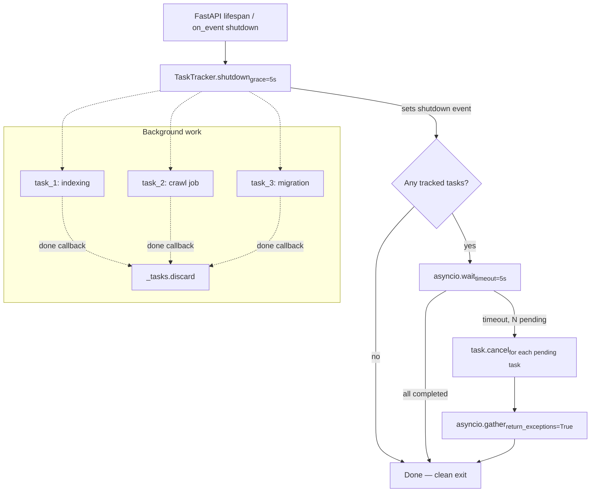

# ADR-0035: Graceful Shutdown for Fire-and-Forget Tasks

**Status:** Proposed

**Deciders:** Magnus Hedemark, Jasper (AI Agent)

**Date:** 2026-06-15

## Context

agent-svc and semantic-svc use `asyncio.create_task()` for fire-and-forget background work: indexing pages in the vector store, processing async jobs (agent, crawl, batch-scrape, extract, llmstxt), and running embedding model migrations.

Across the two services there are 11 `asyncio.create_task()` call sites, of which 9 are true fire-and-forget (the task is never stored, awaited, or cancelled). The remaining 2 are in `research.py`, which already manages tasks correctly via internal `set[asyncio.Task]` tracking and proper cancellation.

When a container receives SIGTERM (deployment, restart, OOM kill), in-flight background tasks are lost without any opportunity to finish or clean up. Incomplete jobs remain stuck in "processing" status in Valkey, partial index writes may be abandoned, and webhooks are never delivered.

This is acceptable for a single-node MVP meant for low-throughput use, but as usage grows the lack of orderly shutdown becomes a reliability concern. The AGENTS.md already acknowledges this trade-off: _"For production deployments with high throughput, restore the RQ queue."_ However, adding basic graceful shutdown to the existing fire-and-forget pattern is a low-effort improvement that bridges the gap until a full worker-queue architecture is warranted.

## Decision Drivers

1. **Zero new dependencies.** The solution must use only `asyncio` stdlib primitives.
2. **Minimal API surface change.** Route handlers should change from `asyncio.create_task(coro)` to `tracker.create_background_task(coro)`. No new configuration, no new HTTP endpoints.
3. **Best-effort semantics.** Tasks get a grace period to finish; after that, cancellation is the fallback. The system does not guarantee completion — only opportunity.
4. **Existing patterns.** agent-svc uses FastAPI `on_event("shutdown")`; semantic-svc uses FastAPI `lifespan`. The solution should augment these existing hooks.
5. **No memory leak.** Tracked tasks must be removed from tracking when they complete (success, failure, or cancellation).
6. **No cross-service package.** semantic-svc copies the ~30-line `TaskTracker` class rather than sharing a `groktocrawl/common/` package, which would conflict with the existing `groktocrawl` CLI binary file.

## Considered Options

### Option A: Tracked tasks + shutdown event (chosen)

Introduce a lightweight `TaskTracker` class that wraps `asyncio.create_task()`, maintains a `set[asyncio.Task]`, and auto-removes tasks on completion via `add_done_callback`. A `shutdown()` method signals a shutdown event, waits for tasks to complete (with a configurable grace period), then cancels and awaits any stragglers.

**Pros:**
- Zero new dependencies — pure `asyncio`.
- Minimal code change: `asyncio.create_task(coro)` → `tracker.create_background_task(coro)`.
- Auto-removal prevents memory leaks.
- Grace period gives well-behaved tasks a chance to finish.
- Integrates naturally with existing shutdown hooks.

**Cons:**
- Still best-effort; tasks exceeding the grace period are cancelled.
- Does not survive process kill (`SIGKILL`, OOM kill). Only helps with graceful shutdown (`SIGTERM`).

### Option B: RQ/worker queue (rejected)

Move all background processing to an RQ queue with dedicated worker containers. Tasks are enqueued and workers pull, process, and acknowledge them. On shutdown, workers drain the queue.

**Pros:**
- Production-grade durability. Survives process crashes.
- Works at scale with multiple workers.
- Acknowledged tasks are never lost.

**Cons:**
- Adds infrastructure (RQ, separate worker container).
- Significant code change — all 9 call sites become enqueue calls.
- AGENTS.md already says "restore the RQ queue" for production — this is a larger effort left for a future ADR.

### Option C: Process-level signal handler (rejected)

Register an `asyncio` signal handler for `SIGTERM` that tracks all outstanding tasks and drains them before the event loop exits.

**Pros:**
- Handles any task, regardless of where it was created.

**Cons:**
- Fragile: signal handlers don't compose well with frameworks (FastAPI already handles signals).
- Difficult to test.
- No clean integration point for per-service configuration.
- Overrides framework behavior, risking double-shutdown or missed signals.

## Decision

We will implement **Option A**: a `TaskTracker` utility class in agent-svc that is reused (by copy) in semantic-svc. All 9 fire-and-forget `asyncio.create_task()` calls will be replaced with `tracker.create_background_task()`. The `TaskTracker` instance lives on `app.state` and is shut down through the existing FastAPI lifecycle hooks.

### Architecture

*Legend: `H`, `I`, `J` represent tracked background tasks. Each auto-removes from the tracking set on completion via `add_done_callback`. The shutdown flow waits 5 seconds for tasks to finish, then cancels any remaining tasks.*

### Task creation lifecycle

## Consequences

### Positive

- **Orderly shutdown.** Tasks get up to 5 seconds to finish normally, reducing stuck jobs and incomplete state.
- **Minimal diff.** Each call site changes from `asyncio.create_task(coro)` to `tracker.create_background_task(coro)`. No new API endpoints, no new configuration.
- **Memory-safe.** Tasks remove themselves from tracking on completion via `add_done_callback`.
- **Consistent with existing patterns.** Augments `on_event("shutdown")` in agent-svc and `lifespan` in semantic-svc.

### Negative

- **Best-effort only.** Tasks exceeding the 5-second grace period are cancelled. Long-running agent jobs or migration tasks will be interrupted.
- **No restart recovery.** Cancelled tasks are lost; jobs remain in "processing" status until TTL expiry (24h). This is a known limitation — a proper work queue is the long-term solution.
- **Code duplication.** The `TaskTracker` class (~30 lines) is copied between agent-svc and semantic-svc rather than shared.

### Migration path

When production throughput warrants a worker-queue architecture (per AGENTS.md), the `TaskTracker` can be replaced with an RQ enqueue call. The `create_background_task` method signature is intentionally simple to make this a drop-in replacement.

## Links

- [ADR-0018: Observability Infrastructure](0018-observability-infrastructure.md) — existing shutdown hook in agent-svc
- [ADR-0034: Lifespan-Based Model Loading and Startup Readiness](0034-lifespan-model-loading.md) — lifespan shutdown pattern in semantic-svc
- [Issue #190](https://github.com/groktopus/groktocrawl/issues/190) — original feature request
