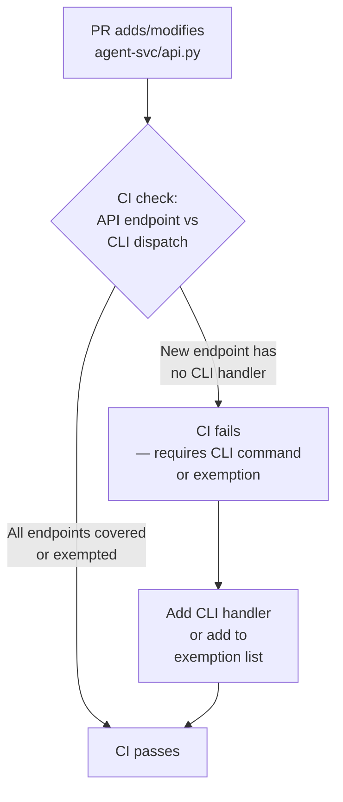

# ADR-0039: API-CLI Surface Must Ship Together

**Status:** accepted

**Deciders:** @magnus919

**Date:** 2026-06-27

## Context

GroktoCrawl's API surface is defined in `agent-svc/agent/api.py` as FastAPI route handlers. Its CLI surface is a single-file script at `groktocrawl` that dispatches to handler functions via an argparse subparser dispatch dict.

Between v0.9.0 and v0.10.0, three new API endpoint groups were added with no corresponding CLI subcommand:

- `POST /v2/monitor/{id}/run` (PR #349) — no `monitor run` CLI
- `PUT /v2/parse/upload/{id}` (PR #347) — no `parse upload` CLI
- `GET/POST /v2/batch/scrape/*` (PR #344) — no `batch-scrape` CLI until PR #354

Each gap was filed as a separate follow-up issue after the fact. The pattern is: **the API endpoint ships, the CLI is forgotten, and a cleanup PR fills the gap weeks later.** This erodes the principle that the CLI is a first-class consumer of the API — not an afterthought.

## Decision Drivers

- Every `/v2/*` endpoint should be accessible from the CLI unless it has a documented exemption
- Prefer prevention over cleanup — catching gaps at CI time is cheaper than filing issues
- The exemption list should be explicit and minimal — infrastructure-only endpoints like `/health`, SSE streaming endpoints that don't map to CLI semantics
- The check must be cheap (sub-second Python parse, no network calls) so it runs in every PR CI

## Considered Options

### Option A: Convention-only (AGENTS.md + PR template)

Rely on AGENTS.md guidance and a PR template checkbox. No enforcement.

- **Pros:** Zero maintenance, zero CI time
- **Cons:** Failed three times in a single release cycle. Humans and agents skip checkboxes. No mechanism.

### Option B: CI check script

A Python script parse `agent-svc/agent/api.py` for `@router.*("/v2/..."` decorators and cross-references against `groktocrawl`'s dispatch dict and an explicit exemption list. Fails the PR build if a new unexempted endpoint has no CLI handler.

- **Pros:** Catches the gap at PR time. Cheap (~200ms parse). Self-documenting exemption list.
- **Cons:** One more CI step to maintain. Regex-based parsing, not AST (but the route patterns are simple enough).

### Option C: ADR + CI check + PR template (this ADR)

All three layers: architectural commitment, automated enforcement, and paper trail.

- **Pros:** Layered defense. The ADR documents *why* for future developers. CI catches the *what*. PR template provides the ritual.
- **Cons:** More ceremony than Option B alone, but the ceremony is front-loaded and the CI script is the durable enforcement.

**Chosen: Option C.**

## Decision

**Chosen option:** Option C — ADR-0039 + CI check script + PR template update. The ADR documents the architectural principle. The CI script enforces it automatically. The PR template checkbox reminds contributors and agents at creation time.

### Mermaid diagram



### Exemption list

The following endpoints are exempt from CLI coverage:

| Endpoint | Reason |
|---|---|
| `/health` | Infrastructure — not a user-facing API |
| `/v2/crawl/{id}/stream` | SSE streaming — consumed by browser/portal, not CLI |
| `/v2/crawl/params-preview` | Internal helper — returns crawl parameter validation, not a user action |
| `/v2/activity` | Diagnostic — used by internal health dashboards |

New exemptions require an ADR amendment.

### CI script design

A Python script (`scripts/check-cli-coverage.py`) that:

1. Reads `agent-svc/agent/api.py` and extracts all `@router.*("/v2/..."` decorators
2. Reads `groktocrawl` and extracts the dispatch dict keys
3. Maps API paths to CLI commands via a path-to-command mapping table
4. Checks against an exemption list
5. Exits non-zero if any unmapped endpoint is found

The script lives at `scripts/check-cli-coverage.py` and runs in CI via a new GitHub Actions workflow.

### CI workflow

A new workflow `.github/workflows/cli-coverage.yml` triggered on PRs that modify `agent-svc/agent/api.py` or `groktocrawl`. Runs `python3 scripts/check-cli-coverage.py` and fails if gaps are detected.

### PR template change

Add a checkbox to the Checklist section:

```
- [ ] New API endpoints have a corresponding CLI subcommand (see ADR-0039)
```

## Consequences

**Positive:**

- CLI gaps are caught at PR time, not weeks later
- The exemption list is explicit and auditable — no silent drift
- Future agents and human contributors get immediate feedback

**Negative:**

- CI script needs maintenance if the dispatch dict structure changes significantly
- Adding a new endpoint now requires either a CLI command or an explicit exemption decision

**Risks:**

- Regex-based parsing could produce false positives/negatives if the route decorator format changes. Mitigation: the script uses a simple line-oriented regex (`@router\.(get|post|put|patch|delete)\(` + capture the first string argument) which has been stable across all 38 existing routes.
- The mapping table needs updating when adding new endpoint groups. Mitigation: the script includes a clear error message that lists the unmapped path and suggests adding it to the mapping or exemption list.

## Links

- [ADR-0038](0038-crawl-engine.md) — previous ADR in sequence
- [PR #344](https://github.com/groktopus/groktocrawl/pull/344) — batch scrape endpoints landed without CLI
- [PR #349](https://github.com/groktopus/groktocrawl/pull/349) — monitor run endpoint landed without CLI  
- [PR #347](https://github.com/groktopus/groktocrawl/pull/347) — parse upload endpoint landed without CLI
- [PR #354](https://github.com/groktopus/groktocrawl/pull/354) — batch-scrape CLI added post-hoc
- [Issue #355](https://github.com/groktopus/groktocrawl/issues/355) — monitor run CLI gap
- [Issue #356](https://github.com/groktopus/groktocrawl/issues/356) — parse upload CLI gap
