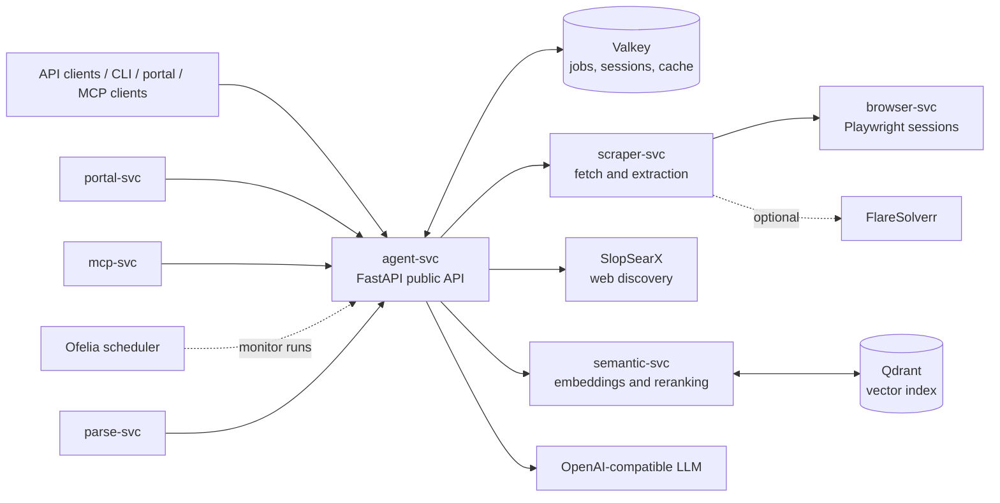
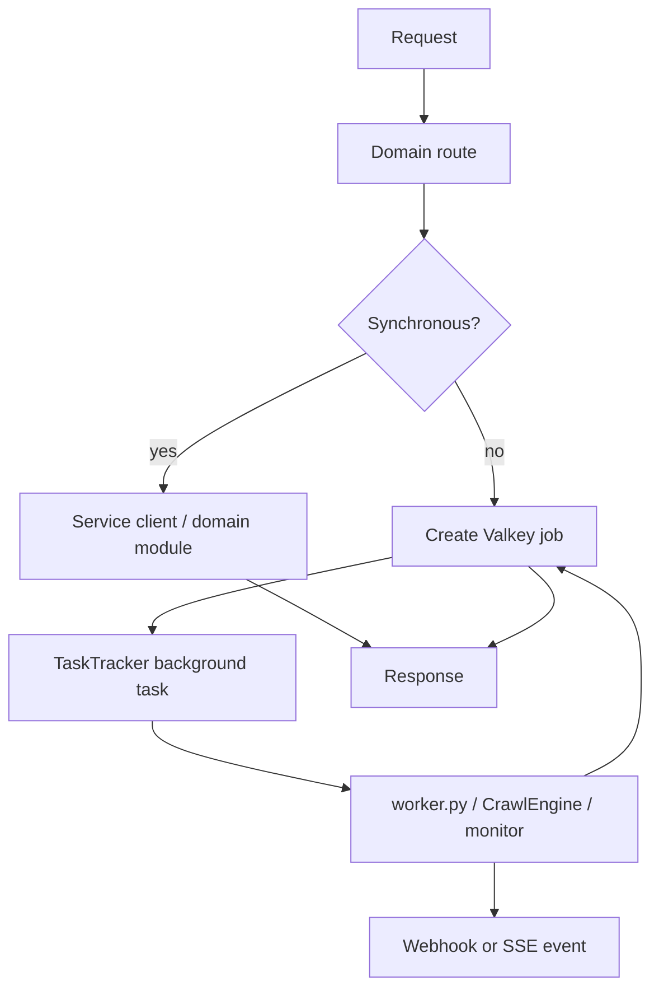
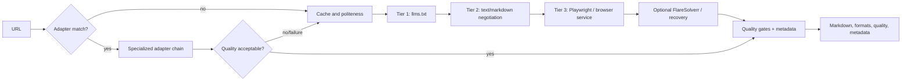

# GroktoCrawl architecture

## System context

`agent-svc` owns the public `/v2` API, authorization, request IDs, health and metrics. It composes domain routers from `agent/routes/`, owns background tasks through `TaskTracker`, and stores durable job state in Valkey. Jobs are processed in-process with `asyncio.create_task()`; there is no RQ worker container.

## Main execution paths

Research code lives in `agent/research/`: it plans a query, discovers sources, scrapes them, synthesizes with the LLM, optionally detects gaps for another pass, and can stream progress and tokens. Research memory combines Valkey metadata with semantic lookup. Crawl uses a breadth-first engine with sitemap discovery, path filters, concurrency, cache controls, robots/politeness handling, canonical/content deduplication, and SSE progress.

## Scraping pipeline

Adapters cover publishing and media, source code and GitHub social content, recruitment, commerce, public-domain books, and security/threat intelligence. They are registered in-process and use per-adapter fallback chains; the generic pipeline remains the final fallback.

## Semantic retrieval

`semantic-svc` loads its embedding model during application lifespan and exposes embedding, reranking, index, migration, retention, and search routers. Qdrant persists named-vector collections. `agent-svc` treats indexing as best effort, so a semantic-service outage does not fail a scrape or crawl request.

## Operational boundaries

- Valkey is the shared state boundary for jobs, monitor/session data, and caches.
- Qdrant is the persistent vector-index boundary.
- SlopSearX and the configured LLM are external capabilities; their availability is surfaced through health checks and request failures/degradation.
- `portal-svc` and `mcp-svc` are thin clients of the public agent API; they do not own duplicate business logic.
- `ofelia` triggers scheduled monitor execution through the agent service.

## Decisions

Accepted decisions describe the architecture currently relied upon; proposed ADRs describe possible future work and are not implementation commitments. See the [ADR index](adr/README.md), especially accepted ADRs for adapters, webhooks, observability, crawl, settings, lifecycle management, and SlopSearX migration.
