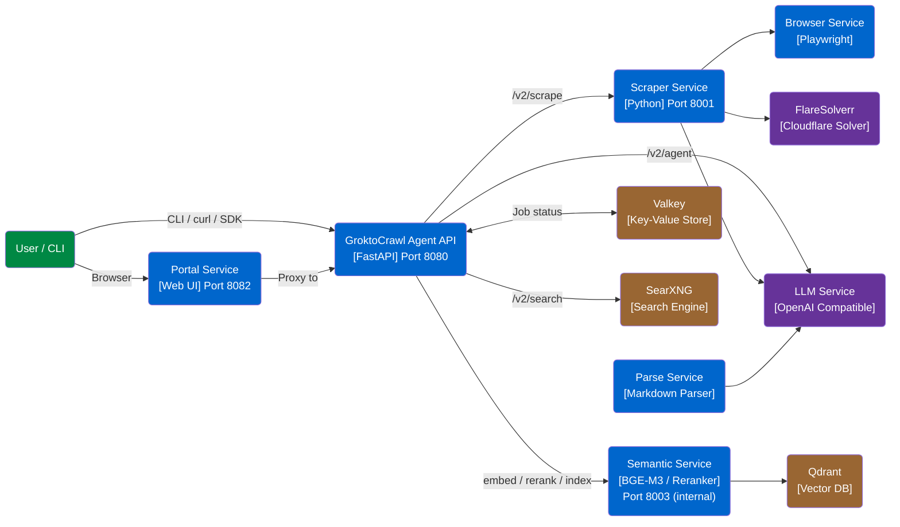
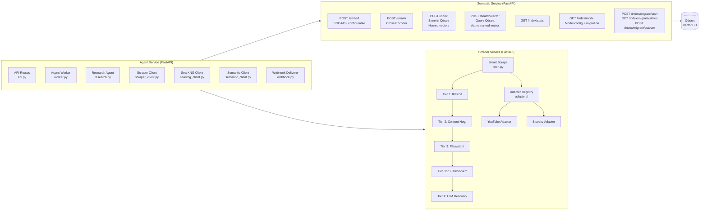
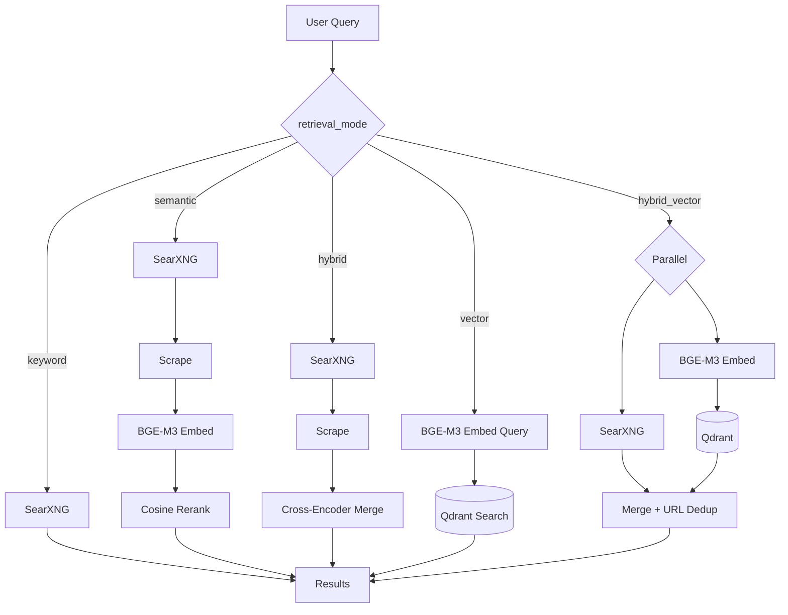

# GroktoCrawl Architecture

## System Context



## Container Diagram (internal services)



## Search Retrieval Pipeline

GroktoCrawl supports five retrieval modes, controlled by the `retrieval_mode` field on `POST /v2/search`:

| Mode | Pipeline | Latency | Phase |
|---|---|---|---|
| `keyword` | SearXNG only | <1s | — |
| `semantic` | SearXNG → scrape → BGE-M3 embed → cosine rerank | 1–30s | Phase 1 |
| `hybrid` | SearXNG → scrape → cross-encoder merge | 2–40s | Phase 1 |
| `vector` | Qdrant only → embed query → vector search | <1s | Phase 2 |
| `hybrid_vector` | SearXNG + Qdrant parallel → merge → dedup by URL | 1–30s | Phase 2 |



## Indexing Pipeline

Every scrape, crawl, and map operation indexes the page in Qdrant via a fire-and-forget hook:

```mermaid
flowchart TD
    SCRAPE[Scrape / Crawl / Map<br/>complete] --> HOOK[agent-svc<br/>indexing hook]
    HOOK --> SVC[semantic-svc<br/>POST /index]
    SVC --> EMBED[BGE-M3 embed<br/>content[:2000]]
    EMBED --> CAT[Domain classification<br/>news / docs / reference / ...]
    CAT --> PAYLOAD[Enrich payload<br/>crawl_count, access_count,<br/>first_indexed_at, domain_category]
    PAYLOAD --> UPSERT[Qdrant upsert<br/>uint64 point ID from URL hash]
    UPSERT --> CHECK{docs > 250K?}
    CHECK -->|yes| SCORE[Score-based eviction<br/>retention_score = domain_mult × recency<br/>+ access_boost + crawl_boost]
    SCORE --> EVICT[Delete lowest-scored docs]
    CHECK -->|no| DONE[✓ indexed]
    EVICT --> DONE

    subgraph AccessTracking [Search Access Tracking]
        SEARCH[POST /search/vector] --> ACCESS[Fire-and-forget<br/>increment access_count<br/>update last_accessed_at]
    end
```

Indexing is best-effort — failure never blocks the scrape/crawl job. The same URL re-indexed updates the existing vector rather than creating a duplicate.

**Retention scoring** (Phase 3): When the index exceeds capacity, all points are scored by a composite function:
- `domain_multiplier`: 0.3 (news) – 1.2 (docs), based on domain classification
- `recency_factor`: decays exponentially from 1.0 (today) to 0.1 (90+ days)
- `access_boost`: up to 1.0 for frequently returned search results
- `crawl_boost`: up to 1.0 for frequently re-crawled pages

The lowest-scored documents are evicted. News and social content evicts first; reference and docs content persists longest.

## Available Adapters

| Adapter | Source | Fallback Chain | Docs |
|---------|--------|----------------|------|
| YouTube | `adapters/youtube.py` | youtube_transcript_api → browser render | ADR-0001–0009 |
| Bluesky | `adapters/bluesky.py` | AT Protocol API → browser render | ADR-0001–0009 |

## Architecture Decision Records

All significant architectural decisions are documented as ADRs in `docs/adr/`. See the [ADR index](adr/README.md) for the full list. Key ADRs for this architecture:

| ADR | Decision |
|-----|----------|
| [ADR-0013](adr/0013-search-architecture-with-vertical-categories.md) | Search architecture with vertical categories |
| [ADR-0017](adr/0017-grounded-qa-endpoint.md) | Grounded Q&A endpoint |
| [ADR-0023](adr/0023-search-type-spectrum-fast-and-rich.md) | Search type spectrum (fast/rich) |
| [ADR-0025](adr/0025-semantic-search-pipeline.md) | Phase 1 semantic reranking |
| [ADR-0026](adr/0026-phase2-vector-index.md) | Phase 2 persistent vector index |
| [ADR-0027](adr/0027-smarter-index-retention.md) | Phase 3 smarter index retention |
| [ADR-0028](adr/0028-embedding-model-migration-path.md) | Phase 4 embedding model migration |
