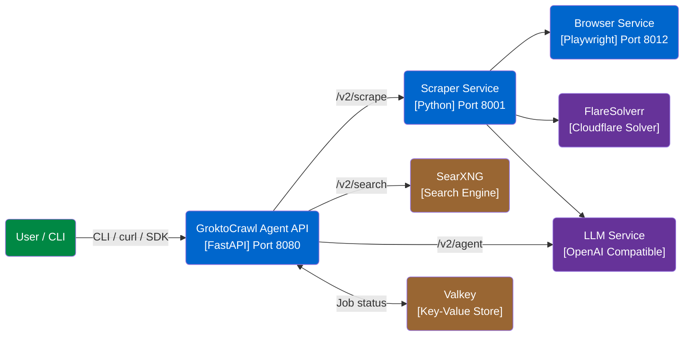
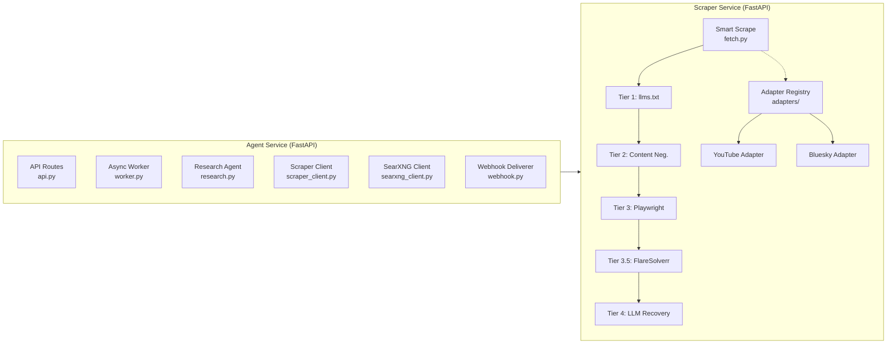

# GroktoCrawl Architecture

## System Context

## Container Diagram (internal services)

## Available Adapters

| Adapter | Source | Fallback Chain | Docs |
|---------|--------|----------------|------|
| YouTube | `adapters/youtube.py` | youtube_transcript_api → browser render | ADR-0001–0009 |
| Bluesky | `adapters/bluesky.py` | AT Protocol API → browser render | ADR-0001–0009 |
