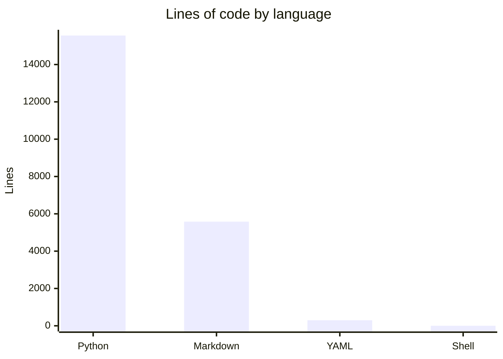

# By the numbers

Data collected on 2026-06-09.

## Size

| Metric | Count |
|---|---|
| Total source files | 136 |
| Python source files | 60 (excluding tests) |
| Test files | 10 (3,469 lines) |
| Config/doc files | 45 markdown + 9 toml |
| Python modules (packages) | 10 |
| Lines of Python (source) | 12,087 |
| Lines of Python (tests) | 3,469 |
| Test-to-code ratio | 0.29 (29%) |

## Activity

**189 total commits** over the project's lifespan (May 21 -- Jun 9, 2026).

| Period | Commits |
|---|---|
| May 21 -- May 31 (11 days) | 108 |
| Jun 1 -- Jun 9 (9 days) | 81 |

**Churn hotspots (last 30 commits):**

| File | Changes |
|---|---|
| `tests/test_substack.py` | 1 |
| `tests/test_stack.py` | 1 |
| `tests/test_phase3_retention.py` | 1 |
| `tests/test_phase2_semantic.py` | 1 |
| `tests/test_cache.py` | 1 |
| `semantic-svc/app.py` | 1 |
| `scraper-svc/scraper/fetch.py` | 1 |
| `scraper-svc/scraper/adapters/substack.py` | 1 |
| `README.md` | 1 |

## Bot-attributed commits

0% of commits are bot-attributed. The project is primarily driven by a single human maintainer. This is a lower bound on AI-assisted work since inline AI tools leave no trace in git history.

## Complexity

| Metric | Value |
|---|---|
| Average Python file size (source) | 262 lines |
| Largest file | `scraper-svc/scraper/fetch.py` (1,646 lines) |
| 2nd largest | `scraper-svc/scraper/adapters/github_social.py` (1,047 lines) |
| 3rd largest | `agent-svc/agent/research.py` (935 lines) |
| Python modules | 10 packages |
| Services | 6 deployable services + 2 fixtures |
| GitHub releases | 5 (v0.2.0 -- v0.6.0) |
