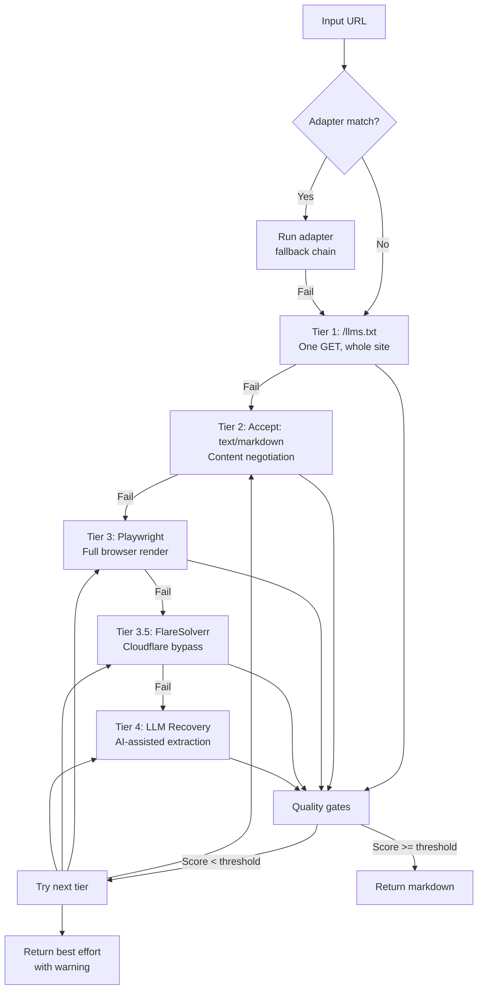

# Scraping pipeline

Active contributors: groktopus

## Purpose

The scraping pipeline is the core content extraction system. It converts URLs to clean markdown through a multi-tier strategy that respects the web's agent-friendly signals before falling back to heavyweight browser rendering.

## How it works

### Tier pipeline

### Post-extraction quality gates

After each tier succeeds, `assess_quality()` in `scraper-svc/scraper/extract.py` runs three checks:

1. **Boilerplate detection** -- analyzes link density and paragraph quality to identify navigation-heavy pages
2. **Completeness check** -- requires minimum content (200 chars) and title (10 chars)
3. **Block page detection** -- pattern matches against 40+ signatures (Cloudflare, login walls, paywalls, CAPTCHA, 404, rate limiting)

Each check produces pass/warn/fail. The composite score (0.0-1.0) determines whether the content is returned or the pipeline degrades to the next tier.

### LLM recovery tier

When all mechanical tiers fail, `scraper-svc/scraper/recovery.py` sends the raw HTML to an LLM for extraction. This is the last resort and catches pages that are semantically meaningful but structurally intractable.

### Politeness protocol

When `SCRAPER_POLITENESS_ENABLED=true`, the politeness module (`scraper/politeness.py`) enforces per-domain rate limiting:

- Fetches and caches `robots.txt` per domain (Valkey-backed, 1h TTL)
- Enforces configurable `Crawl-delay` between requests to the same domain
- Blocks URLs matching `Disallow` paths
- Returns politeness metadata in the scrape response

Off by default. Enable only for production deployments.

### Proxy support

When `SCRAPER_PROXY_URL` is set, all scrape traffic routes through the specified proxy. Supported schemes: `http://`, `https://`, `socks5://`, `socks5h://`. If the proxy is unreachable, GroktoCrawl fails open -- it retries without a proxy and logs the fallback.

### SSRF protection

The scraper blocks navigation to private IPs (RFC 1918), loopback addresses, cloud metadata endpoints, and the Docker host. This applies to both direct URLs and resolved hostnames.

## Key source files

| File | Purpose |
|---|---|
| `scraper-svc/scraper/fetch.py` | Main pipeline orchestration (1538 lines) |
| `scraper-svc/scraper/extract.py` | Content quality gates |
| `scraper-svc/scraper/recovery.py` | LLM-based emergency extraction |
| `scraper-svc/scraper/politeness.py` | Robots.txt respect and rate limiting |
| `scraper-svc/scraper/stealth.py` | Playwright anti-detection configuration |
