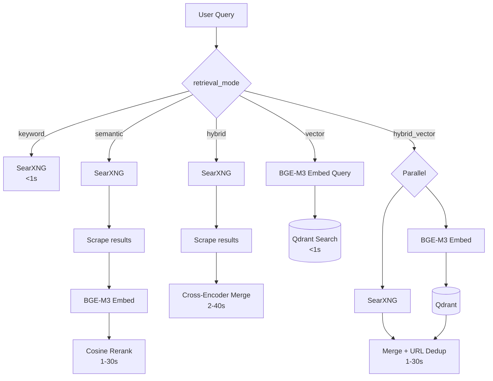

# Search pipeline

Active contributors: groktopus

## Purpose

The search pipeline provides five retrieval modes, from simple keyword search to hybrid semantic+keyword retrieval with cross-encoder reranking. All modes are exposed through the Firecrawl v2-compatible `POST /v2/search` endpoint.

## How it works

### Retrieval modes

### Search type spectrum

The `search_type` parameter controls response depth:

- **`fast`** (default, <1s) -- raw SearXNG results, returned immediately
- **`rich`** (1-3s) -- scrapes top results and synthesizes with LLM

Optional `output_schema` enables structured data extraction from search results in a single round-trip. Optional `system_prompt` guides synthesis behavior.

### Source and category translation

Firecrawl v2's two-dimensional search model (sources, categories) is translated to SearXNG categories:

| Firecrawl | SearXNG |
|---|---|
| `sources=news` | `categories=news` |
| `sources=images` | `categories=images` |
| `sources=web` | `categories=general` |
| `categories=research` | `categories=science` |
| `categories=github` | `categories=it` |

Unknown values pass through for forward compatibility. Defaults to `general`.

### V1 compatibility

`POST /v1/search` returns a flat data array matching Firecrawl v1 format, using the same SearXNG backend.

## Key source files

| File | Purpose |
|---|---|
| `agent-svc/agent/searxng_client.py` | SearXNG client with category translation |
| `agent-svc/agent/api.py` | Search route handlers (v1 and v2) |
| `agent-svc/agent/semantic_client.py` | Client for semantic reranking and vector search |
| `agent-svc/agent/research.py` | Rich search synthesis with LLM |
