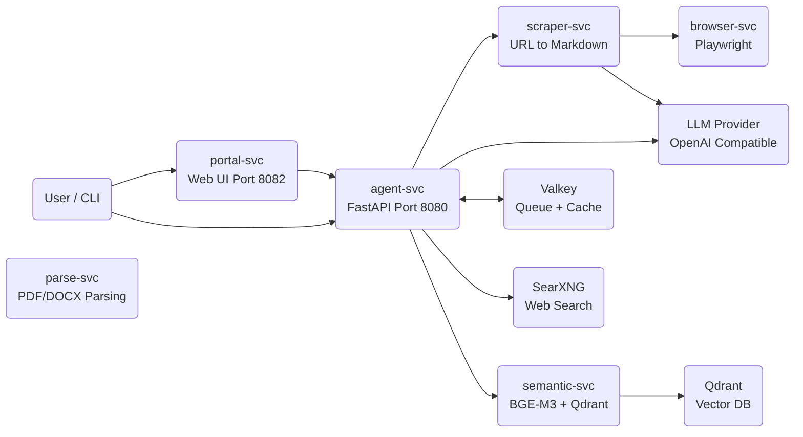
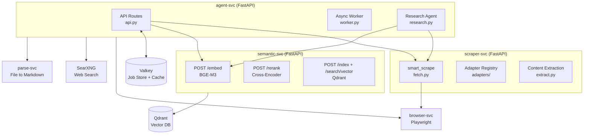

# Architecture

GroktoCrawl is a set of Python FastAPI microservices running in Docker, coordinated by Valkey for job storage and queueing.

## System context

## Service architecture

## Container deployment

The stack runs across 8 core containers plus optional services:

| Container | Purpose | Port (host) |
|-----------|---------|-------------|
| agent-svc | FastAPI API + async workers | 8080 |
| scraper-svc | URL to markdown pipeline | internal |
| browser-svc | Playwright for JS rendering | internal |
| parse-svc | PDF/DOCX/PPTX/XLSX parsing | internal |
| semantic-svc | Embeddings + vector index | 8003 |
| portal-svc | Web UI | 8082 |
| searxng | Meta search engine | 8081 |
| valkey | Job queue + cache | internal |
| qdrant | Vector database | internal |
| flare-solverr | Cloudflare bypass (optional) | 8191 |
| ofelia | Cron scheduler for monitors | internal |

Only agent-svc (8080), portal-svc (8082), searxng (8081), and semantic-svc (8003) expose host ports. Internal services communicate via Docker internal DNS.

## Key data flows

### Scrape flow

1. Adapter registry checks for a site-specific handler (YouTube, GitHub, etc.)
2. Tier 1: fetch `/llms.txt` at the site root
3. Tier 2: request with `Accept: text/markdown` header
4. Tier 3: Playwright render + readability extraction
5. Tier 3.5: FlareSolverr for Cloudflare challenges
6. Tier 4: LLM-based recovery for intractable pages
7. Post-extraction quality gates assess the result

### Agent research flow

1. Receive prompt, optionally with seed URLs
2. Search via SearXNG if no URLs provided
3. Scrape each URL through the scraper pipeline
4. Feed scraped content into LLM with system prompt
5. Return synthesized answer with source citations
6. Streaming variant: emit `sources_pending`/`source_scraped`/`token`/`done` SSE events

### Search retrieval modes

Five modes controlled by `retrieval_mode` on `POST /v2/search`:

| Mode | Pipeline | Latency |
|------|----------|---------|
| keyword | SearXNG only | <1s |
| semantic | SearXNG, scrape, BGE-M3 embed, cosine rerank | 1-30s |
| hybrid | SearXNG, scrape, cross-encoder merge | 2-40s |
| vector | Qdrant vector search only | <1s |
| hybrid_vector | SearXNG + Qdrant parallel, merge, dedup | 1-30s |
